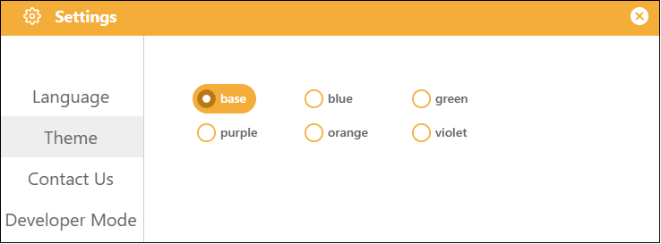
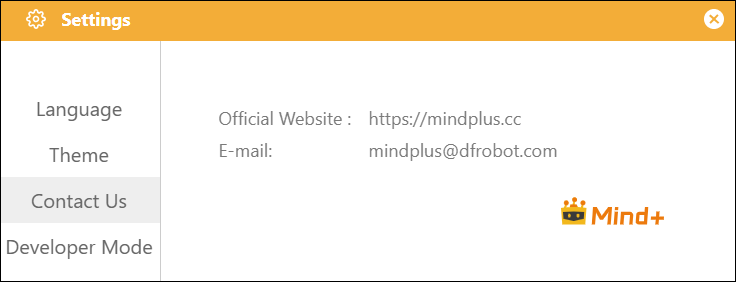
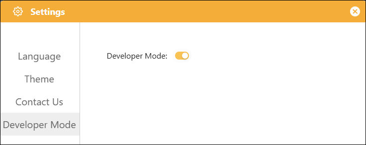

# 3.1.2 Settings

The Settings interface contains the software's global settings. Click the "Settings" button to open it.

#### 1. Language

Supports 20 different languages, selectable by the user, to meet a wide range of user needs.

#### 2. Theme

It supports six different themes, allowing you to change the overall color scheme of the interface to suit different user preferences.

#### 3. Contact Us

Find our official contact information under "Contact Us" in the settings, join our study group, and connect with other users to learn together.

#### 4. Developer Mode

Developer Mode is an advanced feature toggle for Mind+, available to developers and advanced users. Once enabled, users gain access to custom graphical block development, hardware driver library creation, and the ability to import third-party extension packages, allowing them to expand functionality beyond what is built into the official version.

**Recommendations for use**:

* Use cases: Custom extension development, debugging underlying issues;
* Non-essential scenarios: For basic graphical programming instruction and routine project development, there is no need to enable this mode.

