# 3.1.3.1 Motion

Motion-related blocks are primarily used to control a character's movement and rotation—such as moving forward, changing coordinates, or rotating by a certain angle—to create dynamic effects on the stage.

| blocks                                                                                                                      | Note                                                                                                                                        |
| --------------------------------------------------------------------------------------------------------------------------- | ------------------------------------------------------------------------------------------------------------------------------------------- |
| 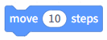 | The character moves the specified number of steps to the right.                                                                             |
| 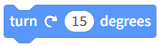 | The character turns to the right by the specified angle.                                                                                    |
| 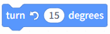 | The character turns left by the specified angle.                                                                                            |
|  | The character moves to a random location or to the position of the mouse pointer.                                                           |
| 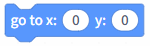 | The character moves to the specified coordinates.                                                                                           |
| 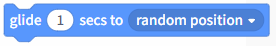 | The character glides to a random location or the mouse pointer's position within a specified time.                                          |
| 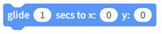 | The character glides to the specified coordinates within the designated time.                                                               |
| 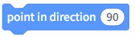 | The character is facing a specified direction.                                                                                              |
| 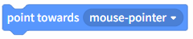 | The character faces the direction of the mouse pointer.                                                                                     |
| 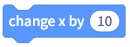 | Increase the character's x-coordinate by the specified value.                                                                               |
| 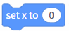 | Set the character's x-coordinate to the specified value.                                                                                    |
| 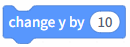 | Increase the character's y-coordinate by the specified value.                                                                               |
| 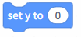 | Set the character's y-coordinate to the specified value.                                                                                    |
| 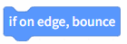 | When a character reaches the edge of the stage, it changes direction and moves in the opposite direction.                                   |
| 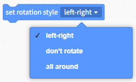 | Set the character's rotation to mirrored, locked, or free. Note that adjusting this setting will change the character's movement direction. |
| 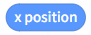 | Get the x-coordinate of the current character; check this box to display it on the stage.                                                   |
| 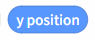 | Get the y-coordinate of the current character; check this box to display it on the stage.                                                   |
| 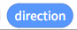 | Get the current character's orientation; check this box to display it on the stage.                                                         |
