# 3.1.3.2 Looks

Looks blocks are used to control the visual presentation of characters or interfaces, such as changing appearances, displaying text, adjusting color effects, or hiding characters, thereby enhancing the visual appeal of the program during execution.

| blocks                                                                                                                           | Note                                                                                                                                                                                                                                             |
| -------------------------------------------------------------------------------------------------------------------------------- | ------------------------------------------------------------------------------------------------------------------------------------------------------------------------------------------------------------------------------------------------ |
| 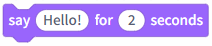 | Have the character display "Hello" in a speech bubble, and set it to disappear after a certain amount of time.                                                                                                                                   |
| 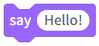 | Have the character display "Hello" in a speech bubble and keep it on screen.                                                                                                                                                                     |
| 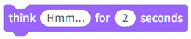 | Have the character display a thought bubble saying "Hmm..." and set it to disappear after a certain amount of time.                                                                                                                              |
| 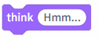 | Have the character display a thought bubble saying "Hmm..." and keep it on screen.                                                                                                                                                               |
| 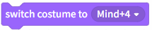 | Change the character to the specified look.                                                                                                                                                                                                      |
| 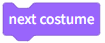 | Switch the character's appearance to the next one in the list.                                                                                                                                                                                   |
| 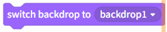 | Change the stage background to the specified background.                                                                                                                                                                                         |
|  | Switch the stage background to the next background in the background list.                                                                                                                                                                       |
| 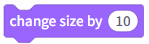 | Increase the character size by the specified percentage; a negative number reduces the size by that percentage.                                                                                                                                  |
| 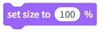 | Set the character size to the specified percentage; the default is 100%.                                                                                                                                                                         |
| 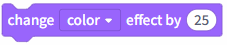 | Increase the specified special effect for the character by the given percentage; a negative number reduces the effect by that percentage. There are seven special effects: Color, Fisheye, Vortex, Pixelation, Mosaic, Brightness, and Ghosting. |
| 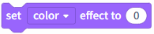 | Set the special effects for the character to a specified percentage. There are seven types of effects: Color, Fisheye, Vortex, Pixelation, Mosaic, Brightness, and Ghosting.                                                                     |
| 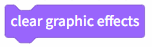 | Clear character graphics effects.                                                                                                                                                                                                                |
| 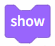 | Show the character on stage.                                                                                                                                                                                                                     |
| 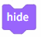 | Hide character: Stop displaying the character on stage.                                                                                                                                                                                          |
| 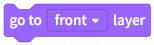 | Move the character to the top or bottom layer.                                                                                                                                                                                                   |
| 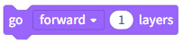 | Move the character forward or backward by a specified number of layers.                                                                                                                                                                          |
|  | Character styling numbers or names; checking the small square can be displayed on stage.                                                                                                                                                         |
|  | The background number or name can be displayed on stage by checking the small box.                                                                                                                                                               |
|  | Character size, check the small square to display on stage.                                                                                                                                                                                      |
