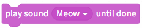
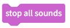
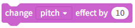
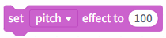
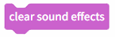
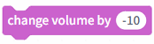
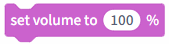

# 3.1.3.3 Sound

Sound blocks are used to play sound effects, control musical rhythm, or adjust volume settings, adding auditory feedback to programs to enhance the interactive experience and emotional impact.

| blocks                                                                                                                            | Note                                                                                                                    |
| --------------------------------------------------------------------------------------------------------------------------------- | ----------------------------------------------------------------------------------------------------------------------- |
|  | Play a sound on the computer (a cat meow or a recorded sound) and wait until it finishes playing (do not interrupt it). |
|  | Play a sound on the computer (meow/recorded sound) (can be interrupted at any time).                                    |
|  | Silence all sounds.                                                                                                     |
|  | Increase the audio effects (pitch/left-right balance) by 10.                                                           |
|  | Set the audio effect (tone/left-right balance) to 100.                                                                  |
|  | Clear all sound effects.                                                                                                |
|  | Reduce the playback volume by 10.                                                                                       |
|  | Set the playback volume to a specified percentage.                                                                      |
|  | Get the volume level of the sound currently being played by the selected character.                                     |
