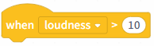
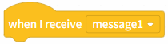

# 3.1.3.4 Events

Event blocks are used to respond to program startup or external trigger behaviors, such as clicking flags, pressing keys, receiving broadcast messages, etc., to control when the program starts executing or responding to external operations.

| blocks                                                                                                                            | Note                                                                                                                                                           |
| --------------------------------------------------------------------------------------------------------------------------------- | -------------------------------------------------------------------------------------------------------------------------------------------------------------- |
|  | When the green flag is clicked, each line of instruction blocks below begins executing in order, often used to follow closely after the initialized operation. |
|  | When you press a key on the keyboard, you start executing each line of instruction blocks in order.                                                            |
|  | When you tap a character, you start executing each line of command blocks in order.                                                                            |
|  | When the background switches to "backdrop1", start executing each line of instruction blocks below in order.                                                   |
|  | When the computer microphone loudness or timer is detected to be above 10, start executing each line of instruction blocks below in order.                     |
|  | When a broadcast message is received, begin executing each of the following instruction blocks in order.                                                       |
|  | Send a broadcast message to all characters and the stage.                                                                                                      |
|  | Send a message to all characters and the stage, and wait until all characters and the stage have received it.                                                  |
