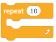
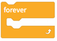
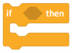
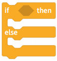
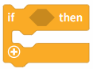
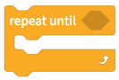
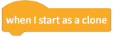

# 3.1.3.5 Control

Control blocks are used to implement logical control of program flow, such as conditional statements, loops, or wait operations, helping the program make decisions based on different situations and run in an orderly manner.

| blocks                                                                                                                             | Note                                                                                                                                                                                                                                    |
| ---------------------------------------------------------------------------------------------------------------------------------- | --------------------------------------------------------------------------------------------------------------------------------------------------------------------------------------------------------------------------------------- |
|  | Wait for 1 second; the program will remain in its current state for one second.                                                                                                                                                         |
|  | Execute 10 times; the program in this loop will run 10 times.                                                                                                                                                                           |
|  | The program runs in a loop.                                                                                                                                                                                                             |
|  | If<condition> is met, then the program will execute; the program will only run if the condition is satisfied.                                                                                                                           |
|  | f the<trigger condition> is met, the program within it is executed; otherwise, the statements in the "else" block are executed.                                                                                                         |
|  | If the<trigger condition> is met, the corresponding program will run; otherwise, if another <trigger condition> is met, the corresponding content will run. This supports multiple conditions. Click the + sign to add more conditions. |
|  | Wait until the<trigger condition> is met before proceeding to the next line of code.                                                                                                                                                    |
|  | Repeat the program in this loop until the<trigger condition> is met to exit the loop.                                                                                                                                                   |
|  | Stop all scripts or the current script; all programs or the program containing the current block will stop running.                                                                                                                     |
|  | Triggered when the clone is launched, used to control the clone's specific behavior.                                                                                                                                                    |
|  | Cloning yourself—that is, duplicating your own character—will trigger the clone's activation function.                                                                                                                                |
|  | Delete the clone containing the current program.                                                                                                                                                                                        |
