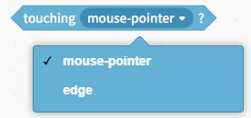
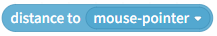
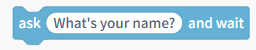
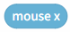
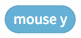
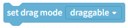
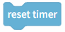
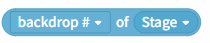
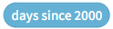

# 3.1.3.6 Sensing

Sensing blocks are used to detect the state or external conditions during program execution, such as determining whether a button is pressed, whether an object is touched, sound volume, or coordinate changes, providing data support for logical judgment and response.

| col1                                                                                                                               | col2                                                                                                                       |
| ---------------------------------------------------------------------------------------------------------------------------------- | -------------------------------------------------------------------------------------------------------------------------- |
|  | This condition applies when the character touches the "mouse pointer" or "stage edge" position; otherwise, it does not.    |
|  | This condition is met when the character encounters a color (color can be chosen at will); otherwise, it does not.         |
|  | This condition applies when a character's color encounters another color; otherwise, it does not.                          |
|  | Return the distance between the character and the mouse pointer, and note that the mouse needs to be on stage.             |
|  | The stage displays the input box and waits, used by the keyboard to allow users to input information through the keyboard. |
|  | Returns the result of the previous input; check the box to display it on the stage.                                        |
|  | This condition is true when a key on the computer keyboard is pressed; otherwise, it is false.                             |
|  | This condition is true when the mouse button is pressed; otherwise, it is false.                                           |
|  | Get the x-coordinate of the mouse's position on the stage.                                                                 |
|  | Get the y-coordinate of the mouse's position on the stage.                                                                 |
|  | Set the character's drag mode to "Dragable" or "Not Dragable."                                                             |
|  | Get the volume level of your computer's microphone; check the box to display it on stage.                                  |
|  | The timer will automatically increase from 0 as time passes; check the box to display it on the stage.                     |
|  | Reset the timer.                                                                                                           |
|  | Retrieve the stage's "background ID," "background name," and the volume set in "Sound."                                    |
|  | Retrieve the "year," "month," "day," "day of the week," "hour," "minute," and "second" of the current time.                |
|  | Get the number of days from 2000 to the present.                                                                           |
