# 3.1.3.8 Variables

Variable blocks are used to create and store dynamic data, such as scores, counts, or text information. Users can record and pass data within a program by setting or modifying the contents of these variables.

| blocks                                                                                                                               | Note                                                                                                                                         |
| ------------------------------------------------------------------------------------------------------------------------------------ | -------------------------------------------------------------------------------------------------------------------------------------------- |
| 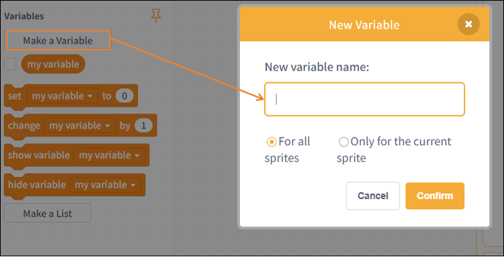 | Create a new variable and set its scope.                                                                                                     |
|  | Retrieve the value of the variable "my variable"; check this box to display the value on the stage.                                          |
| 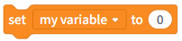 | Set the value of the variable `my variable` to 0.                                                                                          |
|  | Increment the variable `my variable` by 0.                                                                                                 |
|  | Display the variable "my variable" on stage.                                                                                                 |
|  | Hide the variable `my variable` in the scope.                                                                                              |
| 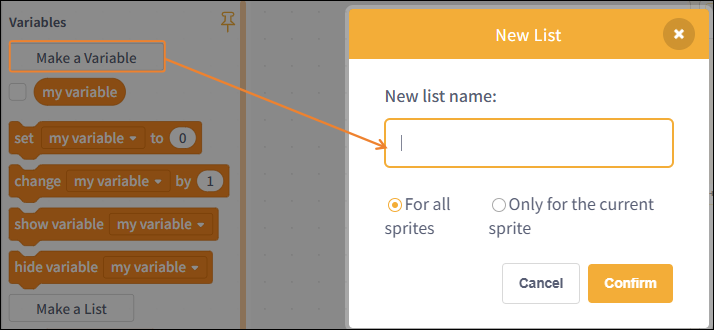 | Create a new list and set a name for it; the name cannot be left blank.                                                                      |
| 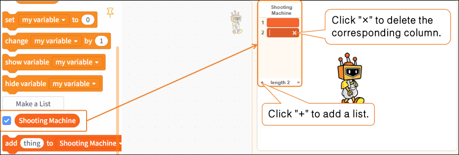 | Set the list name here to "Basketball Machine," and check the "List: Basketball Machine" box in the command area to display it on the stage. |
| 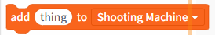 | Add a new list item named "thing."                                                                                                           |
| 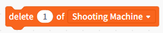 | Delete the first item from the "Shooting Machine" list.                                                                                      |
|  | Delete all items from the "Shooting Machine" list.                                                                                           |
| 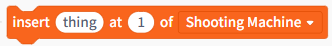 | Enter 1 in the first field of "Shooting Machine"; you can modify any of the specific values.                                                 |
| 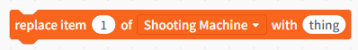 | Replace the first entry in "Shooting Machine" with 1; all other values can be modified.                                                      |
| 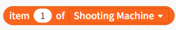 | Retrieve the first item from the "Shooting Machine" list.                                                                                    |
| 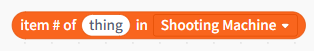 | Get the ID of the first "item" in the "Shooting Machine" list.                                                                              |
|  | Get the ID of the first "item" in the "Shooting Machine" list.                                                                               |
|  | Determine whether the "Shooting Machine" list contains "thing."                                                                              |
| 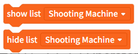 | Show or hide the "Shooting Machine" list.                                                                                                    |
