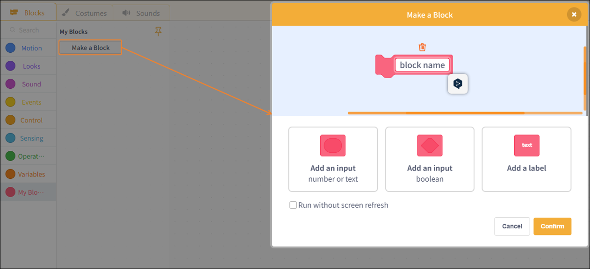
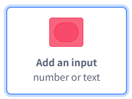
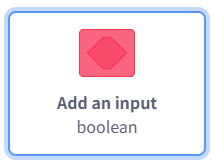
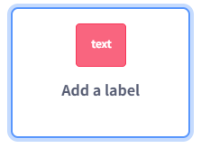

# 3.1.3.9 My Blocks

My blocks are used to create reusable custom functional modules. Users can encapsulate a block of logic into a function and call it multiple times within a program, thereby improving the program's readability and reusability.

| blocks                                                                                                                              | Note                                                             |
| ----------------------------------------------------------------------------------------------------------------------------------- | ---------------------------------------------------------------- |
|  | Add an entry: a number or text.                                  |
|  | Add an input field for a Boolean value.                          |
|  | Adding text labels to function blocks makes them easier to read. |
