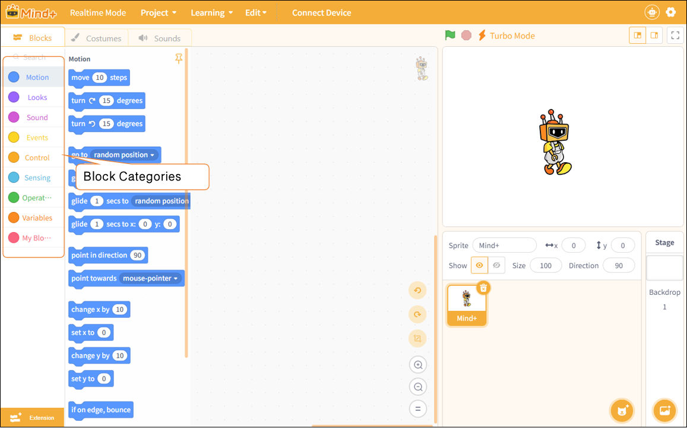

# 3.1.3 Functional Areas-Blocks

The Functional is a key area for operations in realtime mode. It combines program controls, visual effects, and audio controls into a single interface, allowing users to quickly create and debug. It primarily includes Blocks, Costume, and sounds.

#### 1. Blocks

In realtime mode, the blocks in the module area are organized into nine categories based on their functions: Motion, Looks, Sound, Events, Control, Sensing, Operators, Variables, and My Blocks. This categorization helps users quickly locate the blocks they need and build a complete program structure.

Next, we will introduce each programming block by category. For detailed descriptions of each section, please click to jump to:

|         [Motion](3131Motion.md)         | [Looks](3132Looks.md)                   | [Sound](3133Sounds)                    |
| :----------------------------------: | ------------------------------------ | ----------------------------------- |
|    [**Events**](3134Events.md)    | [**Control**](3135Control.md)     | [**Sensing**](3136Sensing.md)    |
| [**Operators**](3137Operators.md) | [**Variables**](3138Variables.md) | [**My Blocks**](3139MyBlocks.md) |
