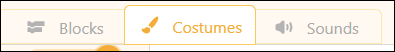
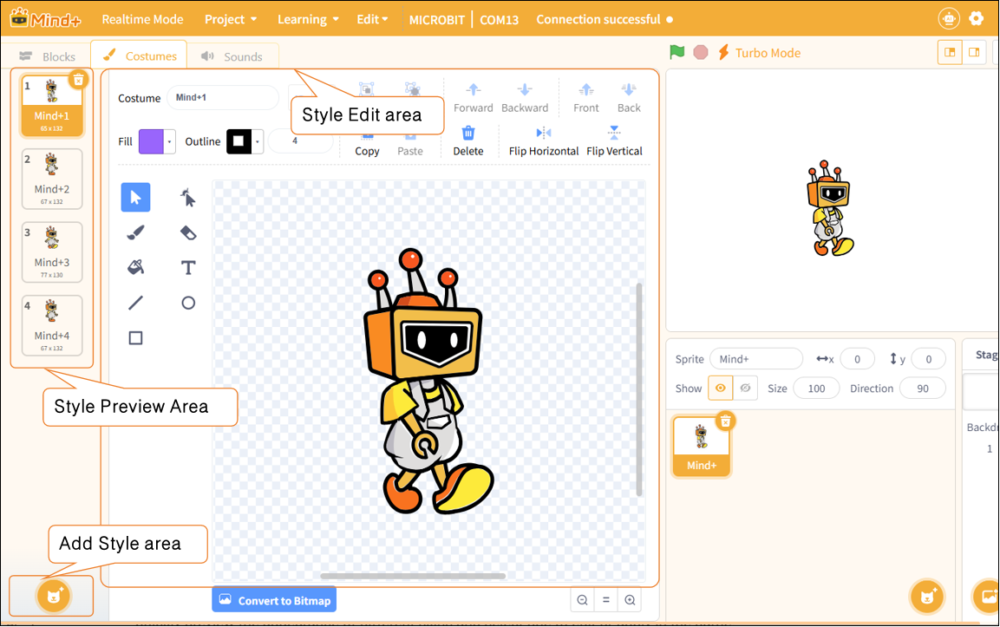
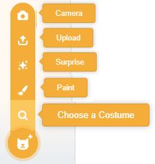
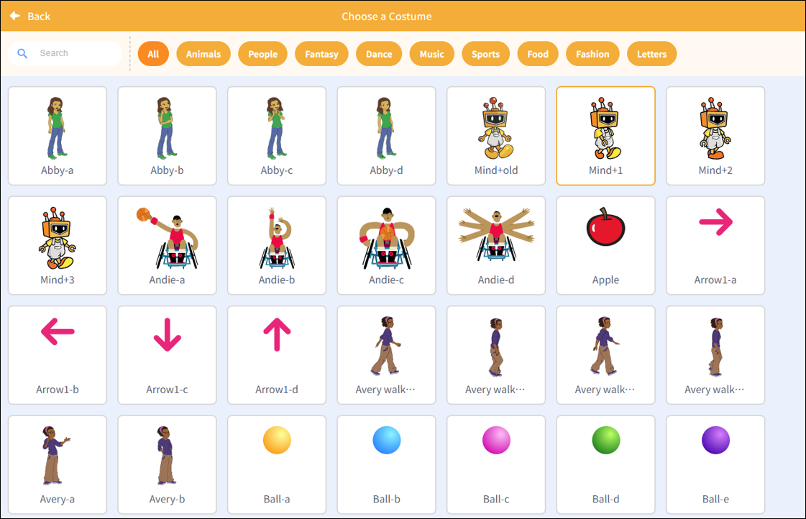
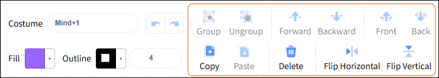

# 3.1.4 Functional area-Costumes

The Functional area is a key area for operations in realtime mode. It combines program controls, visual effects, and audio controls into a single interface, allowing users to quickly create and debug. It primarily includes blocks, Costumes, and sounds.

The Pose section is used to manage and edit character appearances, allowing characters to display a wide range of movements and expressions on stage. It is primarily divided into the Style Preview area, the Add Style area, and the Style Edit area.

##### 1. Style Preview Area

This feature allows users to browse all the skins currently available for a character. Users can quickly preview the appearance of different skins and select one to edit or apply in the game.

##### 2. Add Style area

Used to add new looks to characters, supporting operations such as capturing looks via a camera, uploading local images, obtaining random looks, or creating new looks using drawing tools.

| Features         | Note                                                                                                           |
| ---------------- | -------------------------------------------------------------------------------------------------------------- |
| Camera           | Take a photo using the device's camera, and use it to create a new look.                                       |
| Upload           | Upload image files (such as JPG, PNG, etc.) from your local computer to use as new outfits for your character. |
| Surprise         | The system randomly selects a style from the style library and applies it to the current character.            |
| Paint            | By opening the style editor, users can manually draw a completely new style using the brush tool.              |
| Choose a Costume | Go to the style library, select one of the approximately 700 preset styles, and apply it to your character.    |

**Note**: When selecting a design, you can use the "Select Design" feature to choose the desired design from the design library. The design library offers over 700 diverse designs, covering a wide range of categories such as animals, people, fantasy, dance, music, sports, food, fashion, and letters, to meet users' varied creative needs.

##### 3. Style Edit area

Used to edit and optimize selected models, it supports operations such as grouping, ungrouping, copying, pasting, and mirroring, and allows users to adjust the z-order of model elements (bring forward, send backward, bring to front, send to back), helping users flexibly modify the character's appearance.

| Features          | Note                                        |
| ----------------- | ------------------------------------------- |
| Group             | Each character module can be combined.      |
| Ungroup           | Characters can be split up.                 |
| Forward           | Place the module in front of the other one. |
| Backward          | Place the module behind the other one.      |
| Front             | Place the module at the very front.         |
| Back              | Place the module at the very end.           |
| Copy              | Place the module at the very end.           |
| Paste             | Paste the selected module.                  |
| Delete            | Paste the selected module.                  |
| Flip horizontally | Flip horizontally                           |
| Flip vertically   | Flip vertic                                 |
