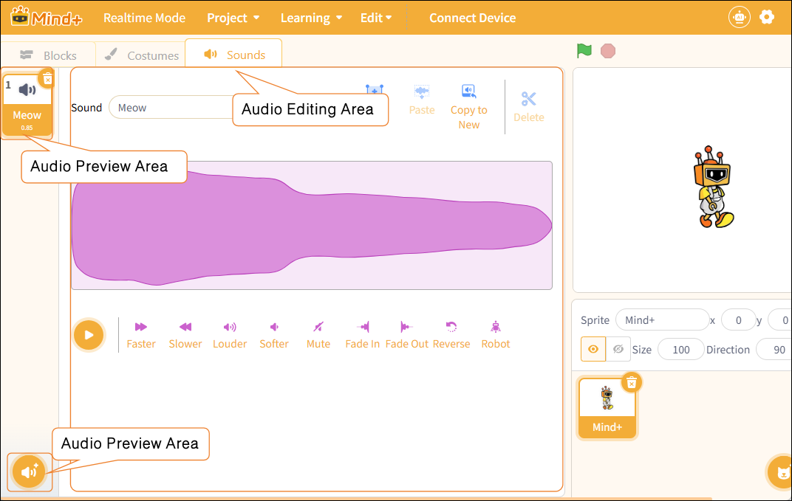
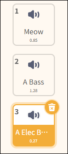
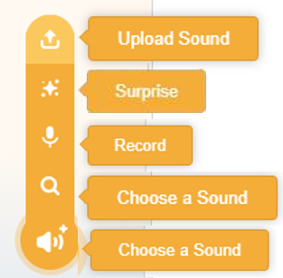
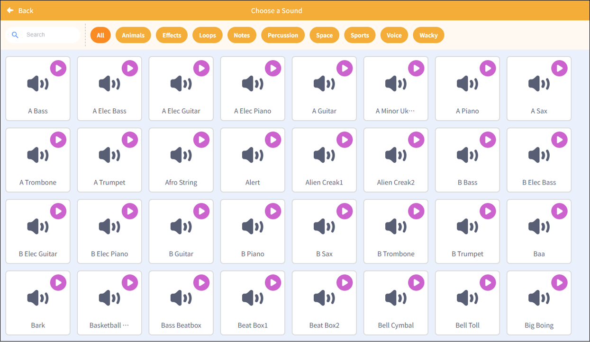
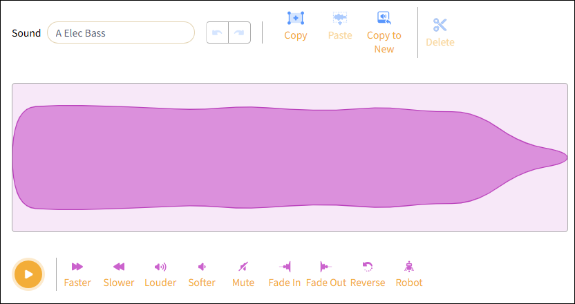

# 3.1.5 Function Area-Sounds

he Function Area is a key area for operations in real-time mode. It combines program controls, visual effects, and audio controls into a single interface, allowing users to quickly create and debug. It primarily includes modules, styles, and sounds.

The sound function area is used to manage and edit the sound effects and background music used by characters, helping them achieve interactive effects with auditory feedback, such as speaking, jumping, and changing facial expressions.

## 1. Audio Preview Area

Used to view all sound files currently owned by the character.

## 2. Audio Import Section

Used to add new sound resources to a character.

| Function       | Note                                                                                                                                                                                                            |
| -------------- | --------------------------------------------------------------------------------------------------------------------------------------------------------------------------------------------------------------- |
| Upload Sound   | Import audio files (such as WAV, MP3, etc.) from your local computer and add them as new voices for characters.                                                                                                 |
| Surprise       | The system randomly selects a sound effect or piece of music from the sound library and adds it to the character's sound list.                                                                                  |
| Record         | By enabling the microphone recording feature, users can record their own voices or ambient sounds to use as character sound effects.                                                                            |
| Select a voice | Open the sound library, select the appropriate sound effect from the preset sound resources, and add it to the character. There is a wide variety of sound effects available, suitable for different scenarios. |

**Note**: The sound library contains over 300 types of sound effects, including animal sounds, sound effects, loopable sounds, musical notes, percussion, space sounds, sports sounds, human voices, and quirky sounds. This makes it easy for users to quickly select the right audio clips for their creative projects.

## 3. Audio Editing Area

Process and optimize the selected audio. The audio editing area provides a variety of editing tools, allowing users to perform the following operations on the selected audio: play, speed up or slow down, increase or decrease the volume, mute, add fade-in/fade-out effects, reverse the audio, and apply special effects such as robotic voices.

| Function Name | Note                                                                                                            |
| ------------- | --------------------------------------------------------------------------------------------------------------- |
| Play          | Preview the current audio effect to easily compare it with the original.                                        |
| Faster        | Increase the playback speed of the audio.                                                                       |
| Slower        | Slow down the playback speed of the audio.                                                                      |
| Louder        | Turn up the volume to make it stand out more.                                                                   |
| Softer        | Turn down the volume to make it softer.                                                                         |
| Mute          | Set the volume to zero to achieve complete silence.                                                             |
| Fade In       | Add a volume fade effect to the audio, starting soft and gradually getting louder.                              |
| Fade Out      | Add a volume fade effect to the audio, starting loud and ending soft.                                           |
| Reverse       | Play the audio in reverse to create a unique sound experience.                                   |
| Robot         | Apply special sound effects to give the audio a mechanical style, making it sound more high-tech or electronic. |
