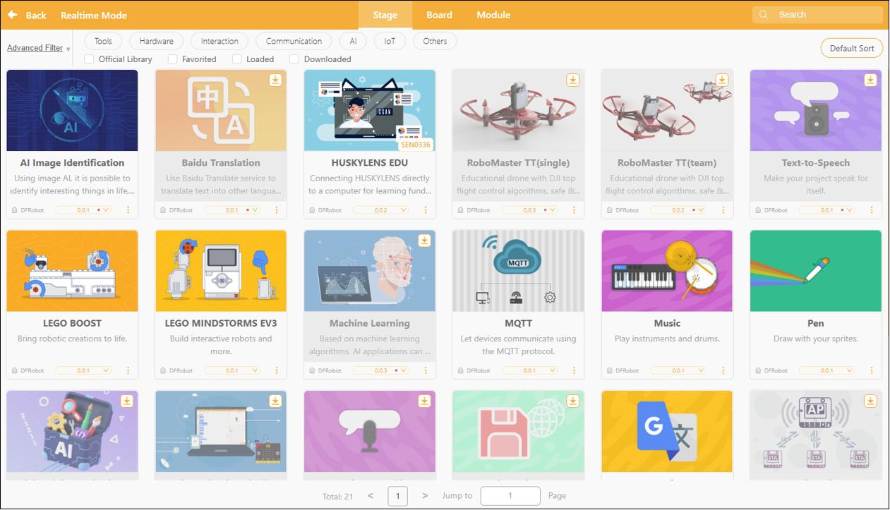
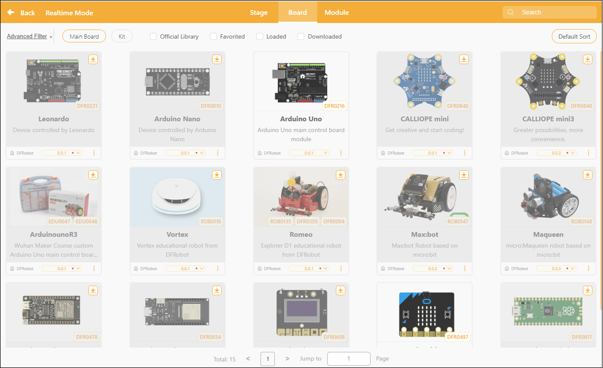
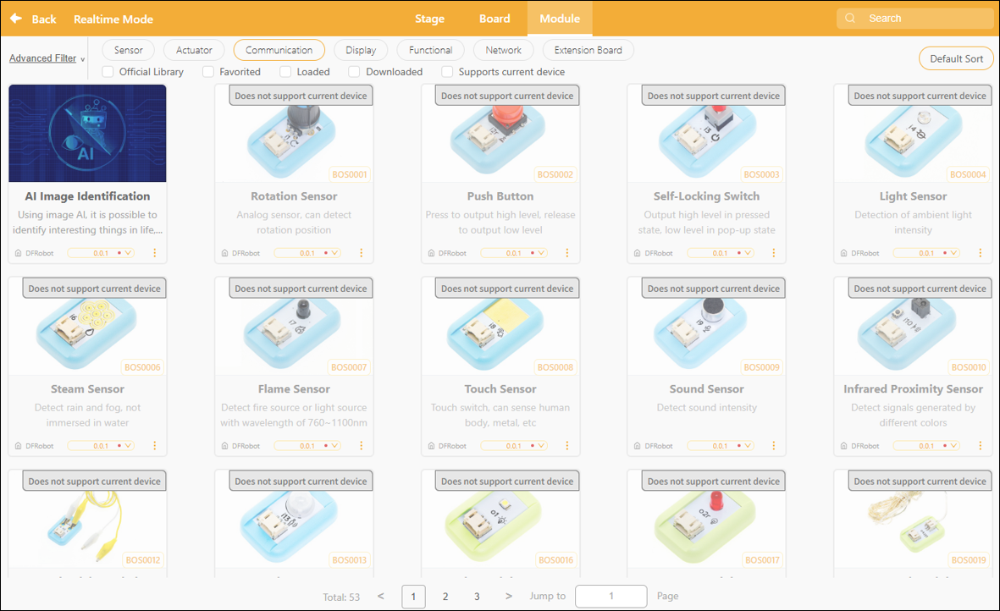
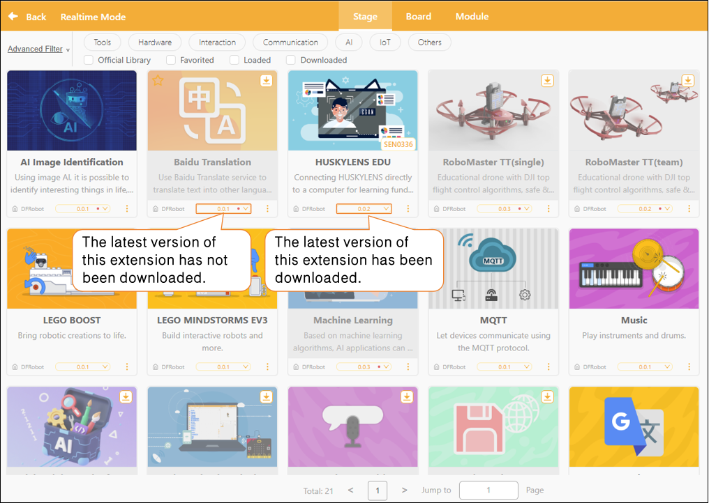
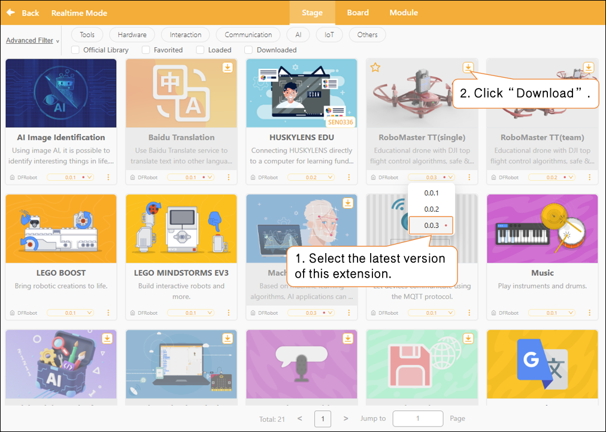

# 3.1.6 Extension Area

In realtime mode, the extension area serves as a key entry point for building project functionality. By selecting the appropriate stage extension, control extension, or module extension, users can transition from virtual stage animations to real-world hardware interactions, enabling a comprehensive creative experience that spans from software to hardware.

Want to learn more about the commands in each extension library? Click "[Extension](../../FAQ/Extension/RealTimeMode/index.md)" to view detailed descriptions.

#### 1. Stage Extensions

In realtime mode, after entering "Block Extensions," select the "Stage" category to access a variety of extension modules related to stage interaction. These extensions are primarily used to enhance interactive capabilities within virtual stage scenes, such as adding voice recognition, translation features, AI-powered controls, image rendering, and network communication.

Important Note: Libraries in the extension must be downloaded before they can be used for the first time. They can only be loaded and their features utilized after the download is complete.

Based on their intended use, the expanded stage content can be categorized into the following seven types:

| Type                             | Sample Extensions                                                                                                 | Feature Description                                                                                            |
| -------------------------------- | ----------------------------------------------------------------------------------------------------------------- | -------------------------------------------------------------------------------------------------------------- |
| AI Interaction                   | AI image recognition, machine learning (ML5), speech recognition                                                  | Enable smart interactions through image or voice recognition.                                                  |
| Translation                      | Baidu Translate, Google Translate                                                                                 | Translate text into other languages in real time; this feature can be used in conjunction with text-to-speech. |
| Perception-related               | Video Detection                                                                                                   | Use a camera to track movements and create an interactive experience.                                          |
| Educational Robotics Integration | RoboMaster TT、LEGO BOOST / EV3 / WeDo 2.0HUSKYLENS Education Edition, RoboMaster TT, LEGO BOOST / EV3 / WeDo 2.0 | A combination of stage animation and interactive robot programming.                                            |
| Data/Network Communications      | MQTT, UDP, TinyWebDB, Cross-Protocol Data Transfer                                                                | Supports network communication or cross-mode data exchange.                                                    |
| Information Retrieval            | Get the weather                                                                                                   | Retrieve real-time weather information online and display it on stage.                                         |

#### 2. Controller Expansion

In realtime mode, select "Block" and navigate to the "Controller Extensions" section to load custom command blocks for various controller boards (hardware control boards). Once loaded, the stage programming area will display hardware control blocks corresponding to the selected controller, allowing users to interactively control real-world devices.

The main controller expansion is designed to connect to various physical hardware motherboards, enabling control of devices such as motors, sensors, displays, and robot platforms through a graphical block-based interface.

#### 3. Module Extensions

Once a user has selected a control board (such as a micro:bit, Arduino, or Control Board) in real-time mode, the system will filter the "Module Extensions" section to display only sensor modules, actuator modules, and function expansion boards that are compatible with that control board.By loading the corresponding module extensions, users can access module-specific control blocks in the programming area to perform functions such as reading sensor data, responding to inputs, and executing actions.

Modules can be categorized by function into the following types:

| Module Type                        | Module Type                                                                                         | Features                                                                               | Common Scenarios                                                 |
| ---------------------------------- | --------------------------------------------------------------------------------------------------- | -------------------------------------------------------------------------------------- | ---------------------------------------------------------------- |
| Common Scenarios                   | Knob modules, pushbutton modules, touch sensors, conductive switches                                | For capturing manual/physical input                                                    | Interactive installations, vehicle control                       |
| Environmental Awareness            | Ambient light sensor, moisture sensor, flame sensor, sound sensor, humidity sensor                  | Used to monitor environmental parameters such as light, water level, flames, and sound | Intelligent early warning systems, automatic monitoring stations |
| Status Detection Class             | Smart grayscale sensor, motion sensor, soil moisture sensor, ultrasonic distance measurement module | Detect the position, motion, or distance of an object                                  | Obstacle-avoidance vehicle, distance alarm                       |
| Output Execution Class             | High-brightness LED modules, color LED strip modules, fan modules, audio recording modules          | Control lights, fans, motors, or audio output                                          | Mood Lights and Mini Fans Project                                |
| Communication/Expansion Interfaces | IIC Address Scan Module, micro:bit Expansion Board, Control Expansion Board                         | Expand I/O ports to support connections with more modules                              | Large-scale project expansion/systematic development             |
| Functionality Enhancements         | DFPlayer MP3 Module                                                                                 | Play audio/voice prompt                                                                | Intelligent Voice Alert System                                   |
| Special Scenarios                  | Flame Sensor, Humidity Alert Module                                                                 | Flame Sensor, Humidity Alert Module                                                    | Security / Agriculture / Research Projects                       |

#### 4. Extension Library Updates

In the Extensions section, each extension module displays version update notifications. If a small red dot appears to the right of the version number, it means the current version has not been downloaded locally.

##### How to Update

Select the latest version of the corresponding extension, then click the "Download" button to update it.

Once the update is complete, the red dot next to the version number will automatically disappear, and you can switch to the desired version as needed.

#### 5. Frequently Asked Questions          

Click here for a solution to the [issue of being unable to download the extension library](../../FAQ/4Extension.md).
