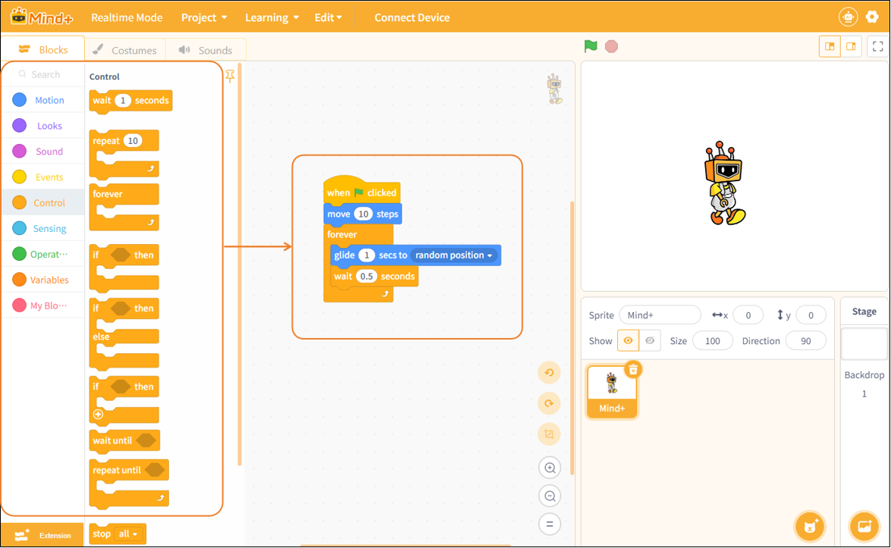

# 3.1.7 Programming Area

The programming area is the core component of real-time mode, used to build program logic and control character behavior. Users can drag instruction blocks from the block categories on the left into the programming area and connect them to create character actions, interactions, and logic controls. Each character has its own programming area, and program editing and execution apply only to the currently selected character.

