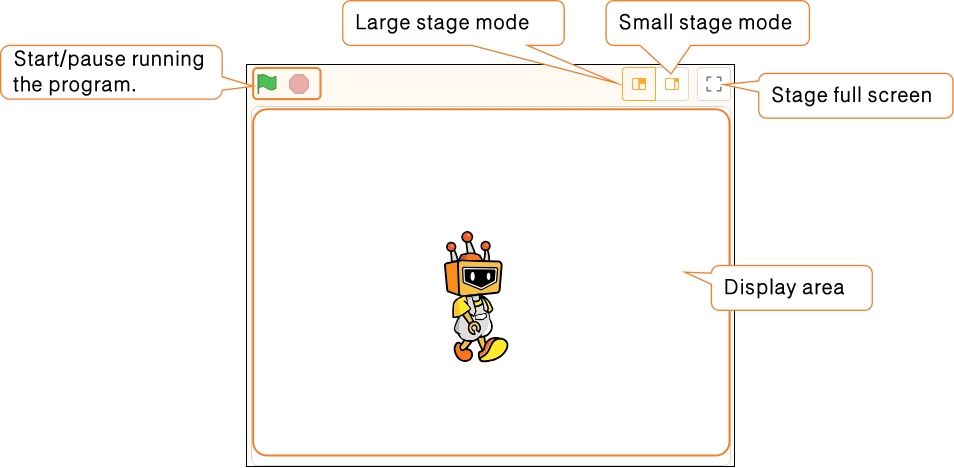

# 3.1.8 Stage Area

The stage area is where the program's effects are displayed. All character movements, dialogue, animations, and interactive scenes are presented here, making it the primary interface for showcasing the program. It serves as the "performance stage" for the project, where the program written by the user is displayed and executed in real time.

