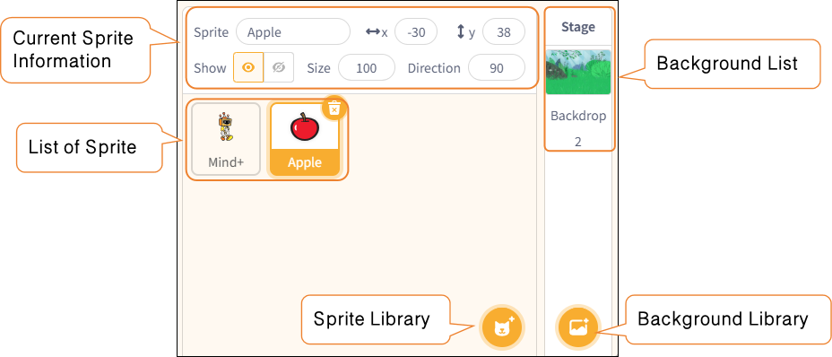
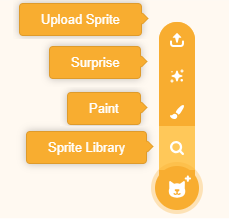
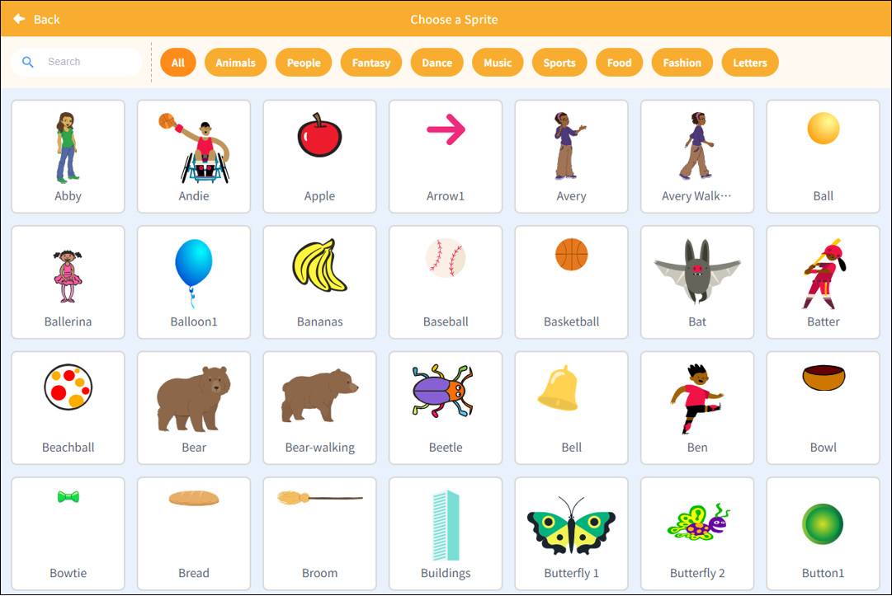
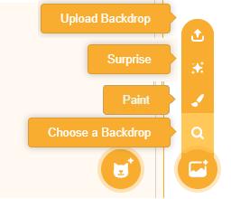
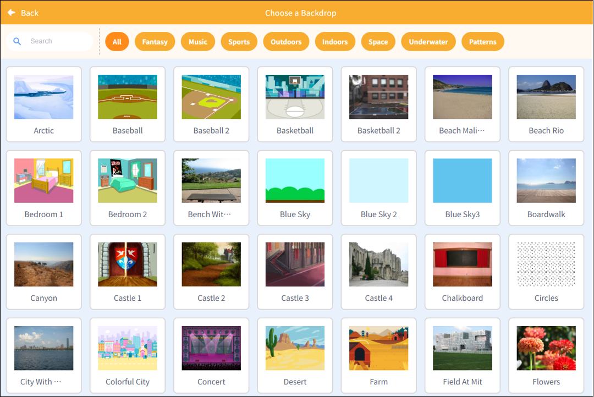

# 3.1.9 Sprite and background area

The Sprite and Backgrounds area is located at the bottom right of the stage area and is used to manage all characters and stage backgrounds in the project.

| Features                     | Note                                                                                                                                                           |
| ---------------------------- | -------------------------------------------------------------------------------------------------------------------------------------------------------------- |
| Current Sprite  Information | Displays the name, position (X/Y coordinates), orientation, and size of the currently selected object, among other properties, which the user can modify here. |
| List of Sprite               | Displays thumbnails of all characters in the project; click a character to switch to editing mode.                                                             |
| Background List              | Display the current stage background. Similar to characters, backgrounds can also be programmed independently (background scripts).                            |
| Sprite Library              | Users can select a character from the character library, upload an image, use the random generator, or use the drawing tool to create a new character.         |
| Background Library           | Supports selecting, uploading, drawing, or randomly generating stage backgrounds from the background library.                                                  |

## 1. Sprite Library

| Features       | Note                                                                                   |
| -------------- | -------------------------------------------------------------------------------------- |
| Upload Sprite  | Import a local image as aSprite  model.                                               |
| Surprise       | The system randomly selects a Sprite and adds it to the stage.                        |
| Paint          | Create customSprite  images using drawing tools.                                      |
| Sprite Library | SelectSprite  models—such as people, animals, and objects—from theSprite  library. |

**Note**: The character library contains over 700 character resources, organized by theme into categories such as people, animals, fantasy, theater, music, sports, food, fashion, and the alphabet, making it easy for users to quickly find characters that fit their scenes and build their stories.

## 2. Background Library

| Features            | Note                                                                                            |
| ------------------- | ----------------------------------------------------------------------------------------------- |
| Upload Background   | Import a local image as the background.                                                         |
| Surprise            | Automatically generate a random background.                                                     |
| Paint               | Hand-drawn original background art.                                                             |
| Choose a Background | Select a preset scene from the background library, such as fantasy, music, sports, or patterns. |

**Note**: The background library includes over 110 scene resources, organized by theme—such as fantasy, music, sports, outdoors, indoors, space, underwater, and patterns—allowing users to quickly select the right setting for their work.

