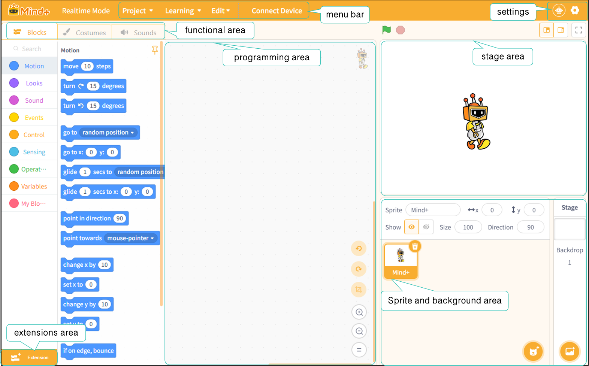

# 3.1 RealTime Mode

RealTime mode is a fundamental programming method in Mind+, allowing users to control the behavior of hardware or stage characters in real time through block-based programming. When the program runs on the computer, instructions are instantly transmitted to the device or stage, enabling interactive control. This mode is ideal for users with no programming experience, or those who want to quickly test ideas and create interactive projects.

## Features

* Commands are executed instantly, and the interface is intuitive.
* There is no need to upload the program to the hardware, so you can make adjustments and run tests at any time.
* Ideal for beginners and rapid prototyping.

### Understanding the Interface

Once you enter real-time mode, you will see the following screen.

The interface can be divided into seven areas: the menu bar, settings, the function area, the extensions area, the programming area, the stage area, and the Sprite and background area.

Next, we’ll take a closer look at these seven areas. For a detailed overview of each area’s features, click here:

| [Menu Bar](311MenuBar.md)                                       | [Settings](312Settings.md)            | [Functional Areas-Blocks](313FunctionalAreasBlocks/index.md) | [Functional area-Costumes](313FunctionalAreaCostumes.md) |
| ------------------------------------------------------------ | ---------------------------------- | --------------------------------------------------------- | ----------------------------------------------------- |
| [Function Area-Sounds](315FunctionAreaSound.md)                 | [Extension Area](316ExtensionArea.md) | [Programming Area](317ProgrammingArea.md)                    | [Stage Area](318StageArea.md)                            |
| [Sprite and background area](319CharactersAndBackgroundArea.md) |                                    |                                                           |                                                       |

### Frequently Asked Questions

Click to view [FAQ](../../FAQ/Coding/RealTimeMode/index.md)
