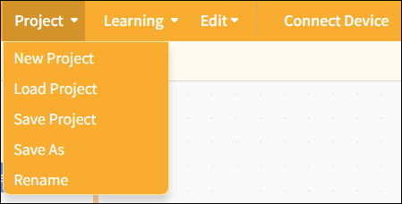
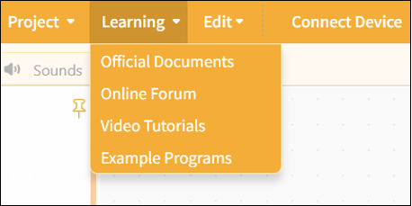
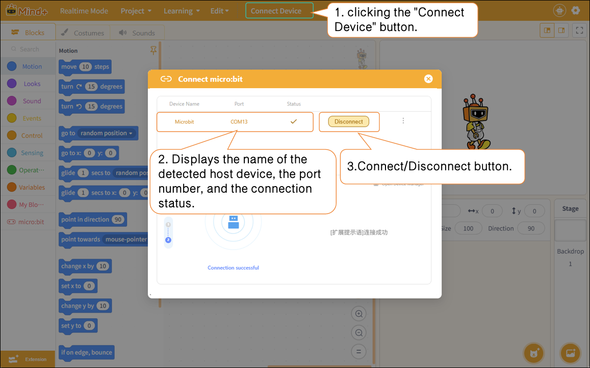

# 3.2.1 Menu Bar

The menu bar provides options for working in real-time mode, including Project, learning, Edit, and Connect Device.

## 1. Project

Provides project management functions, including creating new projects, load projects, saving projects, saving as, and rename, to help users fully manage their programming projects.

| Features      | Note                                                                                                                                                                                    |
| ------------- | --------------------------------------------------------------------------------------------------------------------------------------------------------------------------------------- |
| New Project   | Create a blank project and clear all currently loaded extension instructions so you can start programming from scratch.                                                                 |
| Load project | Load the saved project file to continue editing or running it.                                                                                                                         |
| Save Project  | Save the current project to your computer and update the original file.                                                                                                                 |
| Save As       | Save the current project as a new file. Users can specify the filename and location; the original project will not be overwritten. This is useful for creating backups or new versions. |
| Rename        | Save the current project as a new file. Users can specify the filename and location; the original project will not be overwritten. This is useful for creating backups or new versions. |

## 2. learning

We provide a wide range of learning resources, including official documentation, online forums, video tutorials, and Example programs.

**Note**: The content of the Example program automatically adjusts based on the selected control board to facilitate hands-on learning.

| Features               | Note                                                                                                                                                                                          |
| ---------------------- | --------------------------------------------------------------------------------------------------------------------------------------------------------------------------------------------- |
| Official Documentation | Visit the official documentation page to access a wide range of tutorials                                                                                                                     |
| Online Forums          | Visit the Mind+ official forum to explore a wide range of projects and engage in discussions.                                                                                                 |
| Video Tutorials        | If you're just getting started, you might want to check out some simple examples.                                                                                                             |
| Example Program        | Here is a sample program for the current main control board. Please note that you must first select the main control board in the "Extensions" section before the sample program will appear. |

## 3. Connect Device

In realtime mode, after adding a master device, you can connect or disconnect the hardware by clicking the "Connect Device" button. Quick access links to "Tutorial" and "Open Device Manager" are also provided to help troubleshoot hardware connection issues.

