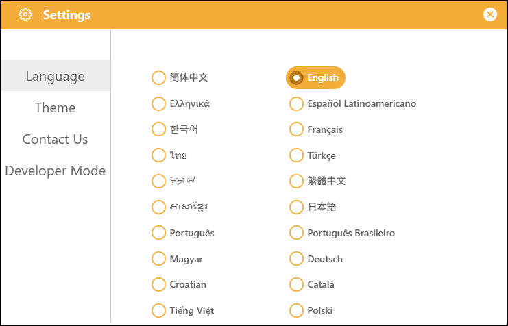

# 3.2.2 Settings

The Settings interface serves as the entry point for Mind+'s global settings; simply click the "Settings" button to open it. The settings in Upload Mode are identical to those in Real-time Mode, offering features such as language switching, theme selection, and "Contact Us." We won't go into further detail here; please refer directly to the settings instructions for Real-time Mode.

