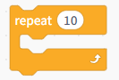
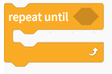
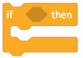
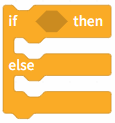

# 3.2.3.1 Control

Control blocks are used to implement logical control of program flow, such as conditional statements, loops, or wait operations, helping the program make decisions based on different situations and run in an orderly manner.

| Blocks                                                                                                                           | Note                                                                                                              |
| -------------------------------------------------------------------------------------------------------------------------------- | ----------------------------------------------------------------------------------------------------------------- |
|  | Maintain the current state for 1 second, then execute the program below.                                          |
|  | The program below this module will not execute until the conditions are met.                                      |
|  | Execute the program within the module 10 times.                                                                   |
|  | Execute the program within the module until the condition is met, then exit the loop.                             |
|  | Execute the program within the module until the condition is met, then exit the loop.                             |
|  | Perform a logical evaluation of a single condition; if the condition is met, execute the program below.           |
|  | Determine whether the condition is true; if true, execute the program above; if false, execute the program below. |
