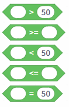
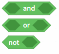
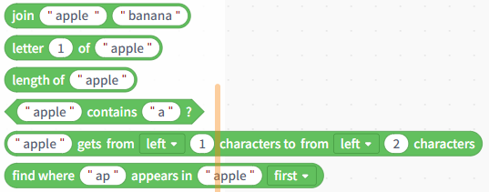
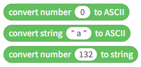
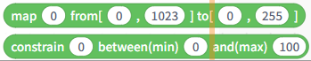

# 3.2.3.2 Operators

Operator blocks are primarily used for mathematical calculations, conditional comparisons, logical evaluations, and text processing, providing the necessary computational support for program control flow and data analysis.

All operator commands have already been described in detail in the real-time mode, so we will not go over them one by one here. Based on their functions, operator blocks can be divided into the following seven major categories:

| Operator Types                | Block                                                                                                                                                                                                                                                                                                                                                                                                  | Note                                                                                                                                                                                |
| ----------------------------- | ------------------------------------------------------------------------------------------------------------------------------------------------------------------------------------------------------------------------------------------------------------------------------------------------------------------------------------------------------------------------------------------------------ | ----------------------------------------------------------------------------------------------------------------------------------------------------------------------------------- |
| Arithmetic operations         |  | Addition, subtraction, multiplication, and division; modulo operations; rounding; and advanced mathematical operations (such as absolute value, floor function, square root, etc.). |
| Random Number Generation      |                                                                                                                                                                                                                                                                      | Addition, subtraction, multiplication, and division; modulo operations; rounding; and advanced mathematical operations (such as absolute value, floor function, square root, etc.). |
| Comparison Operations         |                                                                                                                                                                                                                                                                      | Conditional operators such as greater than, greater than or equal to, less than, less than or equal to, and equal to.                                                               |
| Logical Operations            |                                                                                                                                                                                                                                                                      | Logical AND, logical OR, and logical NOT are used to combine or invert conditions.                                                                                                  |
| String Processing             |                                                                                                                                                                                                                                                                      | Concatenate strings, extract characters, get the length, search for characters, and more.                                                                                           |
| Data Type Conversion          |                                                                                                                                    | Convert between strings, numbers, characters, and ASCII.                                                                                                                            |
| Value Mapping and Constraints |                                                                                                                                                                                                                                                                      | Map the values to a new range or restrict them to a minimum and maximum.                                                                                                            |
