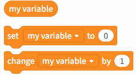
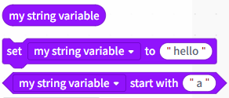
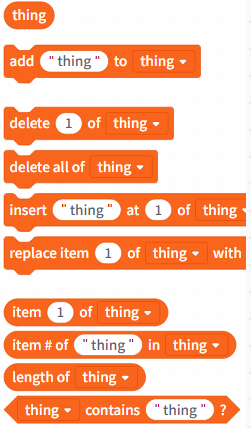

# 3.2.3.3 Variables

Variable blocks are used to store and manipulate data, record information, pass data, or control logic within a program. In upload mode, variables are categorized into three types based on their data type: numeric, string, and list.

| Variable types | Block Commands                                                                                                                     | Note |
| -------------- | ---------------------------------------------------------------------------------------------------------------------------------- | ---- |
| Numeric types  |  |      |
| String type    |  |      |
| List type      |  |      |
