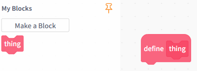
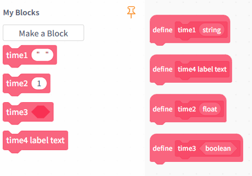

# 3.2.3.4 My Blocks

My blocks are used to encapsulate reusable program logic, making the program structure clearer and easier to maintain. Custom functions are primarily divided into two categories: functions without parameters and functions with parameters.

| Function type              | Block                                                                                                                             | Note                                                                                                                                                                                                                                                                                                  |
| -------------------------- | --------------------------------------------------------------------------------------------------------------------------------- | ----------------------------------------------------------------------------------------------------------------------------------------------------------------------------------------------------------------------------------------------------------------------------------------------------- |
| Function without arguments |  | It does not accept any parameters or return any values; it encapsulates fixed logic and can be called multiple times within a program, thereby improving code reusability.                                                                                                                            |
| Functions with parameters  |  | A function can accept parameters and perform logical operations based on the returned values. Parameter types can include text, numbers, Booleans, or text labels. By passing different parameters, the same function can perform different operations, thereby increasing the program's flexibility. |
