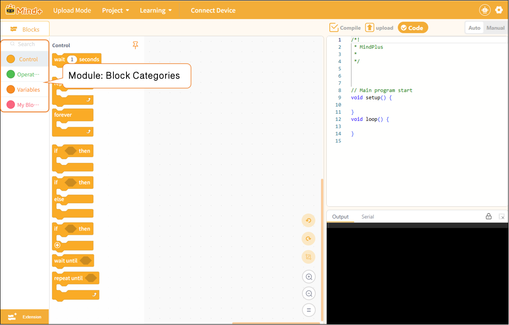

# 3.2.3 Functional Areas-Blocks

In upload mode, the blocks in the module area are categorized into four types based on their functions: controls, operators, variables, and functions, making it easy for users to quickly find what they need.

Next, we will introduce each programming block by category. For detailed descriptions of each section, please click to jump to:

| [Control](3231Control.md) | [Opreators](3232Operators.md) | [Variable](3233Variables.md) | [My Blocks](3234MyBlocks.md) |
| ------- | --------- | -------- | --------- |
