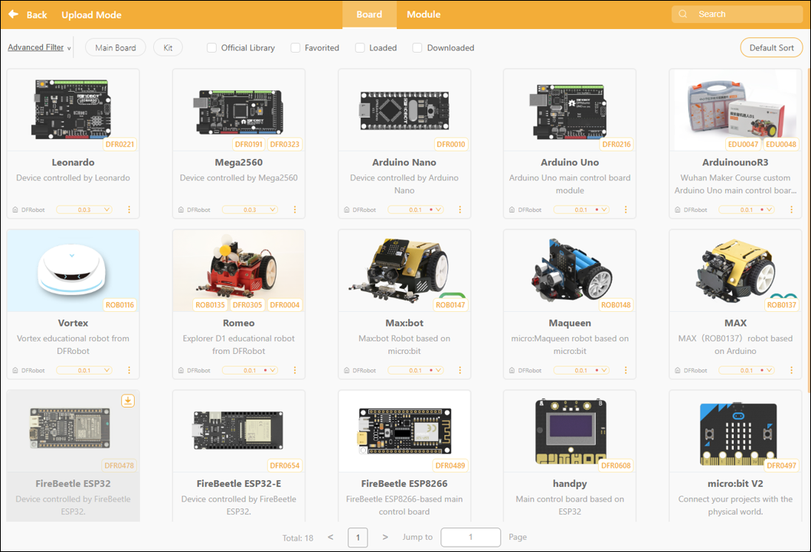
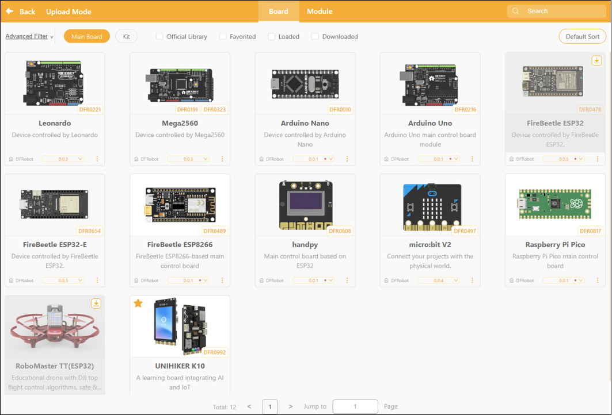
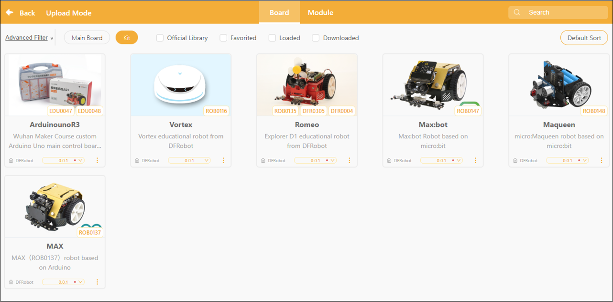
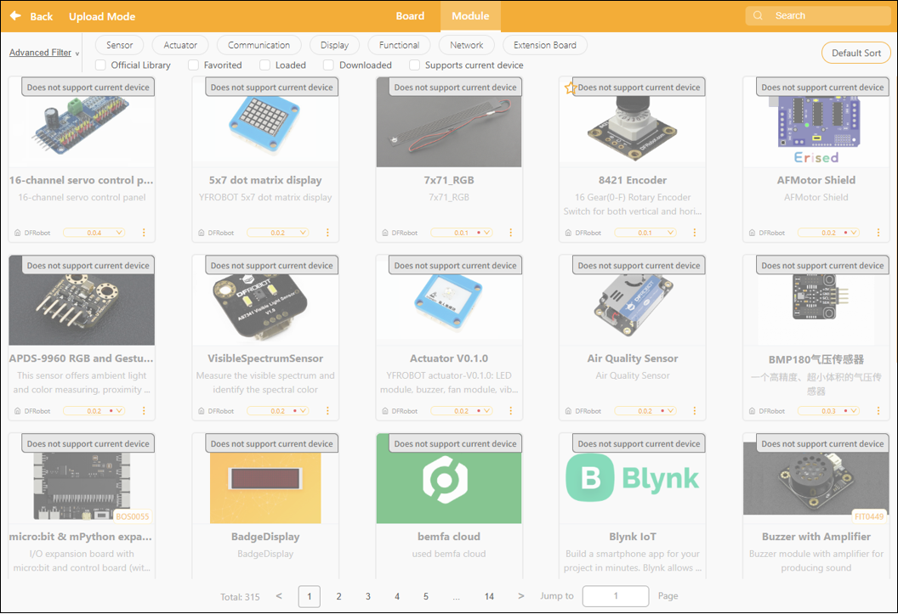
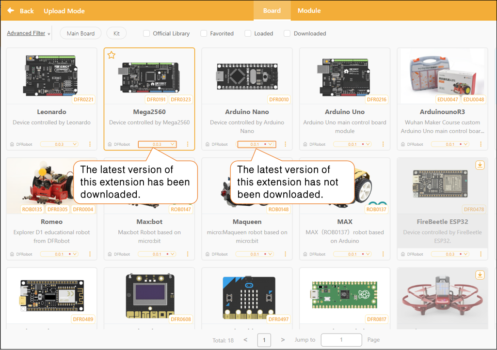
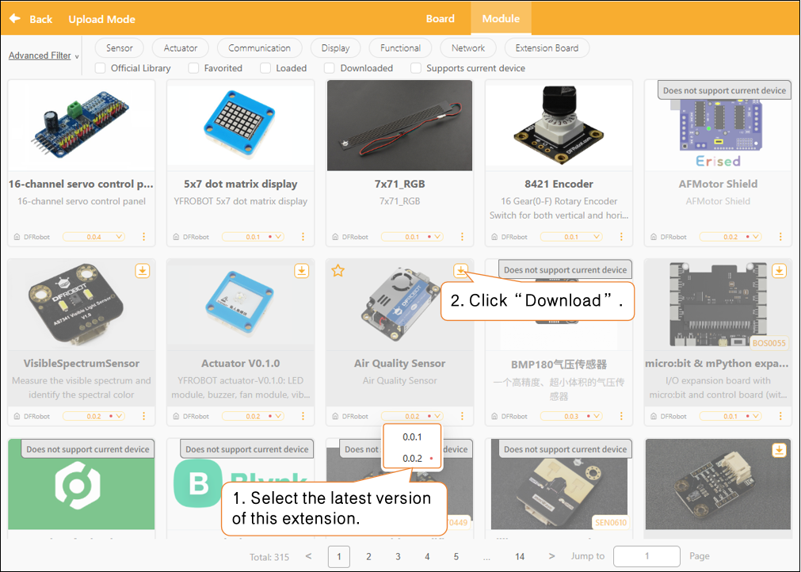
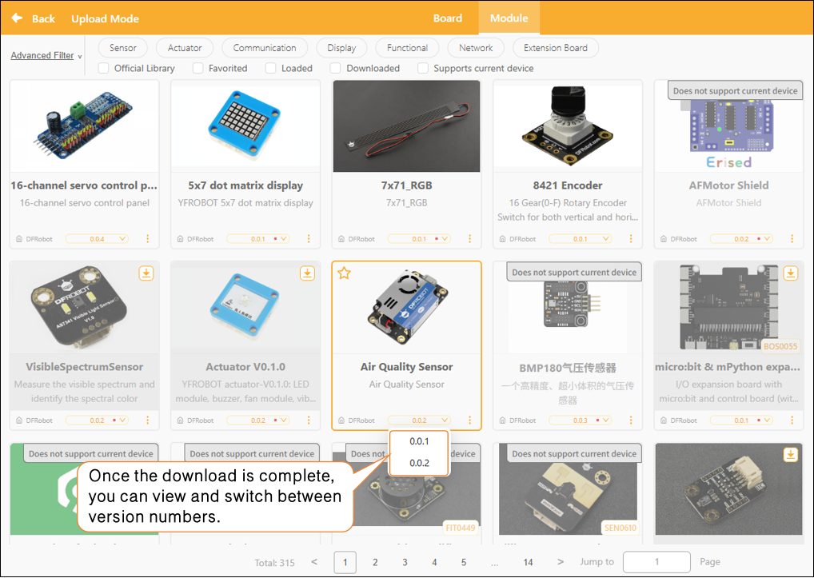

# 3.2.4 Extension Area

In upload mode, the extension area supports two types of extension content:

* **Board Expansion**: Used to select or replace the hardware main controller board currently used for programming, such as Arduino, micro:bit, UNIHIKER K10, etc.
* **Module Expansion**: Once the main controller has been selected, you can further add sensors, actuators, or functional modules compatible with that controller to enhance the program's capabilities.

By configuring the expansion zone, users can flexibly select hardware controllers based on project requirements and load the corresponding modules to enable additional hardware interaction features.

Want to learn more about the commands in each extension library? Click "[Extension](../../Extension/index.md)" to view detailed descriptions of the extension libraries in upload mode.

#### 1. Controller Expansion

The main controller expansion is a core component of the system for identifying and controlling hardware; once loaded, it can drive the corresponding main controller board and its kits. The main controller expansion is further divided into: main controller boards and kits.

Main Board: The core control unit that processes data and controls peripheral devices; it serves as the "brain" of the project and supports 12 different types of main controllers.

Kit: Kit are sets of sensors, actuator modules, or accessories designed to work with the main control board. They expand the board’s functionality and enrich your creative projects. In upload mode, six different kits are supported.

#### 2. Module Extensions

Module expansion is a feature that automatically displays compatible modules after a main control board has been selected. The system lists available modules based on the hardware supported by the main control board, and users can manually select and add them according to project requirements. These modules can be used to enhance project functionality and enable more sophisticated interaction and control.

In the module expansion section, the modules are divided into 7 major categories, covering a variety of hardware forms:

| Module Category      | Uses                                                              |
| -------------------- | ----------------------------------------------------------------- |
| sensor               | Collect environmental data, such as temperature, light, and sound |
| Actuator             | Control output devices such as servos, motors, buzzers, and LEDs  |
| Communication Module | Supports wireless transmission or communication between devices   |
| Monitor              | Image or text displayed, such as on a screen                      |
| Functional Modules   | Provide specific algorithms or logical functions                  |
| Online Services      | Connect to the Internet to enable online features                 |
| Expansion board      | Expand I/O pins or enhance connectivity                           |

#### 3. Extension Library Updates

In the Extensions section, each extension module displays version update notifications. If a small red dot appears to the right of the version number, it means the current version has not been downloaded locally.

##### How to Update

Select the latest version of the corresponding extension, then click the "Download" button to update it.

Once the update is complete, the red dot next to the version number will automatically disappear, and you can switch to the desired version as needed.

#### 4. Frequently Asked Questions

Click here for a solution to the [issue of being unable to download the extension library](../../FAQ/Coding/RealTimeMode/Extension/HowToFixExtensionLibraryDownloadFailure.md).
