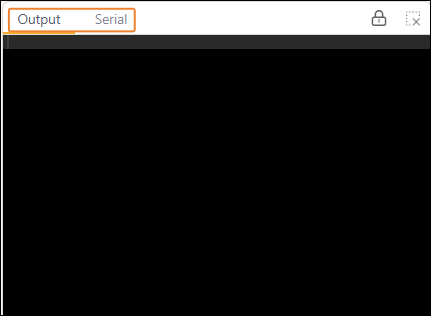
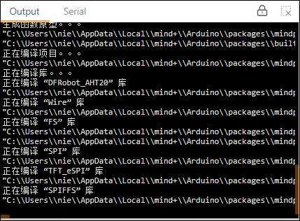
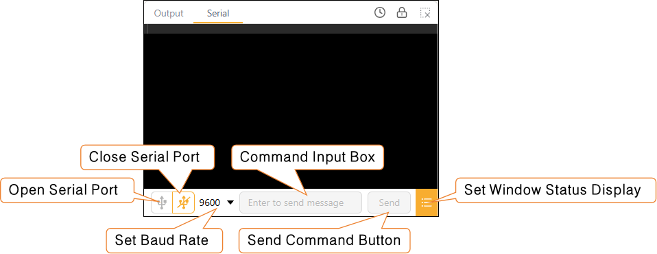

# 3.2.7 Serial Monitor

A serial monitor is an essential tool for viewing program runtime information. It primarily offers two functions: output and serial monitoring.

#### 1. Output

Used to display system prompts during the "compilation" and "upload" processes, such as whether the compilation was successful or if the upload is progressing normally, allowing users to quickly determine whether the program has been successfully flashed to the main control board.

#### 2. Serial Port Monitoring

Used to view data sent by the main control board via the serial port during program execution. Users can add serial print commands to their programs to output variable values, sensor data, or operational status to this window, thereby facilitating program debugging and data monitoring.

