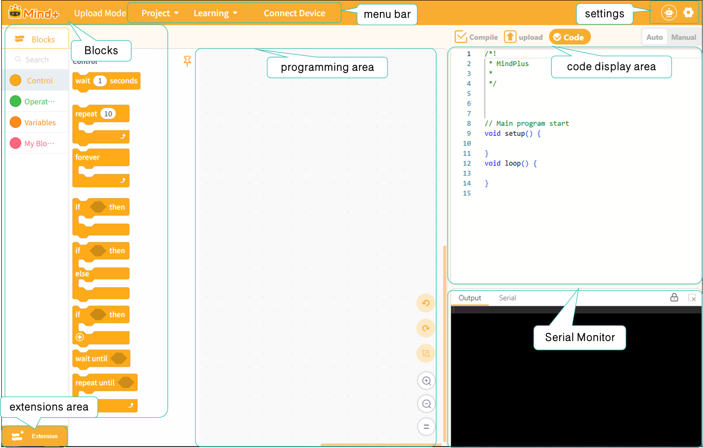
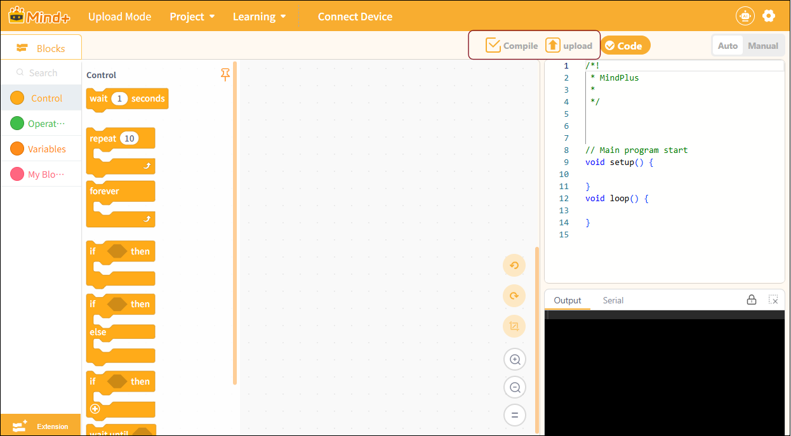
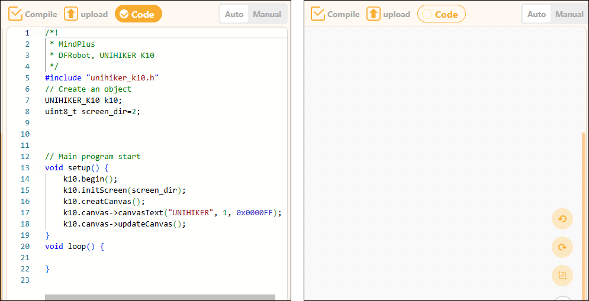

# 3.2 Upload Mode

Upload mode is an operating mode in which the program is written directly to a hardware device (such as the micro:bit, UNIHIKER K10, Arduino Uno, or other microcontrollers). In this mode, the program does not rely on real-time execution but is stored in the hardware, allowing the device to operate independently. Even if the device is disconnected from the computer, the program will continue to run.

## Features

* Program runs independently: Once uploaded, the program is stored within the hardware, allowing the device to operate offline.
* No real-time connection required: It runs without needing a constant connection to a computer, making it ideal for presentations or projects that run continuously.
* Supports a variety of hardware: Compatible with devices such as the micro:bit, UNIHIKER K10, and Arduino Uno.
* High code execution efficiency: In upload mode, the program runs directly on the device, resulting in faster response times.

### Understanding the Interface

Once you enter upload mode, you will see the following screen.

The interface can be divided into seven areas: the menu bar, settings, modules, the extension area, the programming area, the code display area, and the serial monitor.

For a detailed description of each section's features, click here to jump to that section.

| [Menu Bar](321MenuBar.md)                 | [Settings](322Settings.md)                 | [Functional Areas-Blocks](323FunctionalAreasBlocks/index.md) | [Extension Area](324ExtensionArea.md) |
| -------------------------------------- | --------------------------------------- | --------------------------------------------------------- | ---------------------------------- |
| [Programming Area](325ProgrammingArea.md) | [Code Display Area](326CodeDisplayArea.md) | [Serial Monitor](327SerialMonitor.md)                        |                                    |

Before we look at the upload interface, we need to understand two very important buttons: “Compile Only” and “Compile and Upload.” Located in the upper-left corner of the code display area, these buttons control the program’s compilation and upload process—a critical step before the program runs.

| Button Name | Feature Description                                                                                                                                      | Applicable Scenarios                                                                                                 |
| ----------- | -------------------------------------------------------------------------------------------------------------------------------------------------------- | -------------------------------------------------------------------------------------------------------------------- |
| Compile     | Perform a syntax check on the program code and generate an executable file, but do not upload it to the main control board.                              | Used to verify that the program is correct and compiles successfully, making it easier to debug and modify the code. |
| upload      | After the compilation and verification are complete, the generated executable program is automatically uploaded to the main control board for execution. | Once the program has been verified, the code is flashed onto the device to enable offline execution.                 |

At the top of the code display area, there is a checkbox for the code section. Checking it displays the code, while unchecking it hides the code.

### Frequently Asked Questions

Click to view [FAQ](../../FAQ/Coding/UploadMode/index.md)
