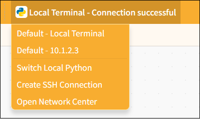

# 3.3.1 Menu Bar

In Python Block Mode, the single-column area offers three different ways to interact with the project: Projects, Tutorials, and Local Terminal.

#### 1. Project

Provides project management functions, including creating new projects, opening projects, saving projects, saving as, and renaming, to help users fully manage their programming projects.

| Features      | Note                                                                                                                                                                                    |
| ------------- | --------------------------------------------------------------------------------------------------------------------------------------------------------------------------------------- |
| New Project   | Create a blank project and clear all currently loaded extension instructions so you can start programming from scratch.                                                                 |
| Load project | Load the saved project file to continue editing or running it.                                                                                                                         |
| Save Project  | Save the current project to your computer and update the original file.                                                                                                                 |
| Save As       | Save the current project as a new file. Users can specify the filename and location; the original project will not be overwritten. This is useful for creating backups or new versions. |
| Rename        | Save the current project as a new file. Users can specify the filename and location; the original project will not be overwritten. This is useful for creating backups or new versions. |

## 2. learning

We provide a wide range of learning resources, including official documentation, online forums, video tutorials, and Example programs.

**Note**: The content of the Example program automatically adjusts based on the selected control board to facilitate hands-on learning.

| Features               | Note                                                                                                                                                                                          |
| ---------------------- | --------------------------------------------------------------------------------------------------------------------------------------------------------------------------------------------- |
| Official Documentation | Visit the official documentation page to access a wide range of tutorials                                                                                                                     |
| Online Forums          | Visit the Mind+ official forum to explore a wide range of projects and engage in discussions.                                                                                                 |
| Video Tutorials        | If you're just getting started, you might want to check out some simple examples.                                                                                                             |
| Example Program        | Here is a sample program for the current main control board. Please note that you must first select the main control board in the "Extensions" section before the sample program will appear. |

## 3. Local Terminal

The local terminal is not just "a place to run Python programs"; it also serves as a hub for selecting environments and connecting to terminals, allowing you to switch freely between your computer, a local interpreter, the UNIHIKER M10, or remote devices to meet the execution needs of different projects.

| Features                                | Note                                                                                           |
| --------------------------------------- | ---------------------------------------------------------------------------------------------- |
| Default - Local Terminal                | Connect to the current computer environment and run the Python program directly (run locally). |
| Default: 10.1.2.3 (example)             | Connect to a recognized remote device (such as the UNIHIKER M10) to execute code.             |
| Switch to the local Python installation | Change the version of the local Python interpreter (e.g., Python 3.8 or Python 3.10).          |
| Create a new SSH connection             | Manually establish a remote terminal connection (for devices that support SSH).                |
| Open the Network Center                 | Access the network device management interface to manage remote connections and device status. |
