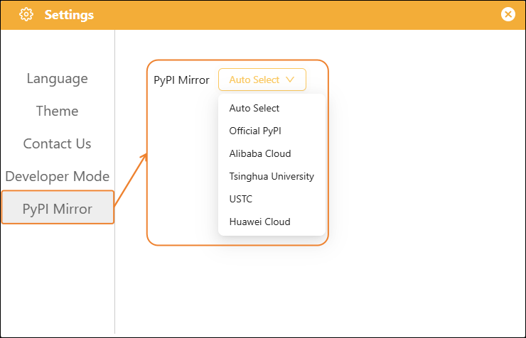

# 3.3.2 Settings

The settings interface is the global configuration entry for Mind+. Click the "Settings" button in the upper right corner to open it. In addition to Language, Theme, Contact Us, and Developer Mode, a new PyPI mirror source selection option has been added.

PyPI mirror sources are download servers for Python packages. Switching between different mirror sources can resolve issues such as **slow download speeds, connection timeouts, and installation failures**. This option defaults to "Auto Select," which automatically tests and selects the fastest responding mirror source based on your network environment, eliminating the need for manual switching.

