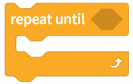
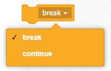
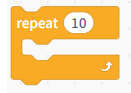
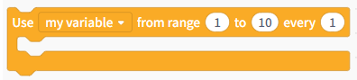
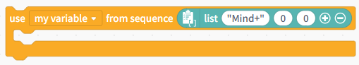
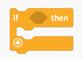
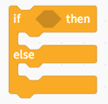
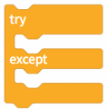
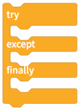

# 3.3.3.1 Control

Control statements can be broadly categorized into four types based on their structure and usage logic: while loops, for loops, conditional structures, and exception-handling structures.

## Loop Control

Used to repeat a section of code.

| Blocks                                                                                                                          | Note                                                                                                                                                                                                                                                                            |
| ------------------------------------------------------------------------------------------------------------------------------- | ------------------------------------------------------------------------------------------------------------------------------------------------------------------------------------------------------------------------------------------------------------------------------- |
|  | Loop indefinitely, repeating all the code within the module.                                                                                                                                                                                                                    |
|  | Execution will not continue until the condition is true.                                                                                                                                                                                                                        |
|  | Execute the program within the module until the condition is true, at which point the loop terminates.                                                                                                                                                                          |
|  | Loop Break Conditions: Select "Break from Loop": Exits the loop entirely and executes the statements following the loop body. Select "Continue to Next Iteration": Exits the current iteration and proceeds to the next one. Note: This instruction must be used within a loop. |
|  | When the program reaches this point, it will wait for 1 second before continuing with the rest of the code.                                                                                                                                                                     |

## for loop

Used for looping by count or by set.

| Blocks                                                                                                                          | Note                                                             |
| ------------------------------------------------------------------------------------------------------------------------------- | ---------------------------------------------------------------- |
|  | Set the number of iterations to 10.                              |
|  | Loop through a custom range from 1 to 10, with a step size of 1. |
|  | Iterate through the loop and list each element in the list.      |

## Conditional Statements

Conditional Statements

| Blocks                                                                                                                          | Note                                                                                                        |
| ------------------------------------------------------------------------------------------------------------------------------- | ----------------------------------------------------------------------------------------------------------- |
|  | A single-branch conditional statement executes the code in the loop body if the condition is true.          |
|  | A two-way conditional statement: if the condition is true, execute Program 1; otherwise, execute Program 2. |

## Exception Handling Structures

Errors that may occur in the user capture program, thereby enhancing program stability.

| Blocks                                                                                                                          | Note                                                                                                                                                                                                                                                                                                                   |
| ------------------------------------------------------------------------------------------------------------------------------- | ---------------------------------------------------------------------------------------------------------------------------------------------------------------------------------------------------------------------------------------------------------------------------------------------------------------------- |
|  | An exception-handling statement that, when an error occurs during the execution of the code within the `try` block, interrupts that execution and executes the code within the `except` block.                                                                                                                     |
|  | An exception handling statement: when an error occurs during the execution of the code within the `try` block, the execution of that code is interrupted and the code within the `except` block is executed; however, the code within the `finally` block is executed regardless of whether an exception occurs. |
