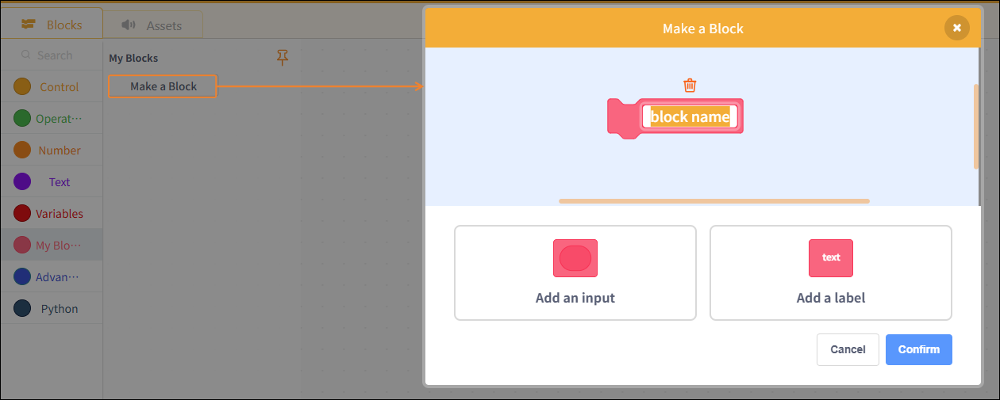
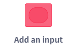
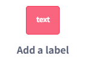

# 3.3.3.6 My Blocks

Functions are used to encapsulate reusable program logic, making the program structure clearer and easier to maintain. Custom functions are primarily divided into two categories: functions without parameters and functions with parameters.

## Create a new function

| Blocks                                                                                                                           | Note                                                             |
| -------------------------------------------------------------------------------------------------------------------------------- | ---------------------------------------------------------------- |
|  | Add an input parameter.                                          |
|  | Adding text labels to function blocks makes them easier to read. |
