# 3.3.3.7 Advanced Types

Python's advanced data types include four core container types: lists, tuples, dictionaries, and sets. These provide powerful capabilities for organizing and processing data in program development. Each type has its own unique characteristics and use cases, enabling it to meet a variety of programming needs.

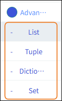

| Advanced Types | Note                                                                                                                                                                                         | Features                                                                                                                                                                                                                                                                                                                               |
| -------------- | -------------------------------------------------------------------------------------------------------------------------------------------------------------------------------------------- | -------------------------------------------------------------------------------------------------------------------------------------------------------------------------------------------------------------------------------------------------------------------------------------------------------------------------------------- |
| List           | Lists are one of the most commonly used data structures in Python and are denoted by square brackets [ ]. They are ordered, mutable collections of elements that can store data of any type. | 1. Elements are stored in the order they are inserted, and each element has a corresponding index. 2. Supports dynamic insertion, deletion, and modification operations.  3. Can contain mixed data types (numbers, strings, and even other lists).  4. Supports slicing operations, making it easy to extract subsets. |
| Tuple          | Tuples are created using parentheses ( ) and are an ordered but immutable data structure. Once created, their contents cannot be modified.                                                   | 1. Elements are arranged in a specific order and can be accessed by index. 2. Immutability ensures data integrity and prevents accidental modifications.  3. They are more memory-efficient than lists and offer faster access speeds.  4. They support tuple unpacking, which facilitates multi-variable assignment.  |
| Dictionary     | A dictionary is created using curly braces { } and stores data in the form of key-value pairs. It provides fast key-based lookup capabilities.                                               | 1. Key-value pair structure; keys must be immutable types. 2. Values are accessed directly via keys, resulting in extremely high lookup efficiency.  3. Supports dynamic addition, deletion, and modification of key-value pairs.                                                                                            |
| Set            | Sets are created using curly braces { } or the set() function and store unique elements in an unordered collection. They are specifically designed to handle sets of unique data.            | 1. Automatically removes duplicate elements. 2. Elements are stored in an unordered manner; indexed access is not supported.  3. Supports mathematical set operations (union, intersection, difference, etc.).  4. Elements must be immutable types.                                                                    |

## List

| Blocks                                                                                                                                | Note                                                                                                                                                                                      |
| ------------------------------------------------------------------------------------------------------------------------------------- | ----------------------------------------------------------------------------------------------------------------------------------------------------------------------------------------- |
| 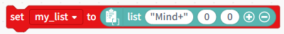 | Assigning a list to a variable is equivalent to naming the list.                                                                                                                          |
|  | Initialization list.                                                                                                                                                                      |
|  | Clear the data from the list.                                                                                                                                                             |
| 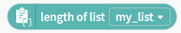 | Get the length of the list.                                                                                                                                                               |
|  | Determine whether the list is empty.                                                                                                                                                      |
| 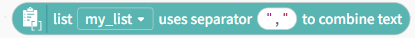 | Use the separator "," to join the elements in a list. For example, if the list contains ["a", "b", "c"], combining them with the separator ";" results in: a;b;c                          |
| 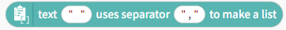 | Connect text characters into a list using the delimiter ",". For example: If the contents of the list are [a-b-c], using the delimiter "-" to create the list results in: ["a", "b", "c"] |
| 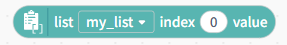 | Use an index to access values in the list; the first element of the list has an index of 0.                                                                                               |
| 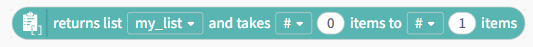 | Retrieve a specific element in a list by its index; you can retrieve it in ascending or descending order.                                                                   |
| 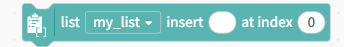 | Insert an element into the list at a specified position using an index.                                                                                                                   |
| 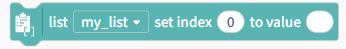 | Modify the value at a specified position in the list using an index.                                                                                                                      |
| 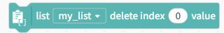 | Delete the corresponding element from the list using its index.                                                                                                                           |
| 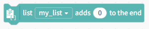 | Add the element to the end of the list.                                                                                                                                                   |
|  | Concatenate the two lists into a single list.                                                                                                                                             |
|  | Convert the tuple to a list.                                                                                                                                                              |
| 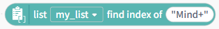 | Given the content of an element, find its corresponding index.                                                                                                                            |
| 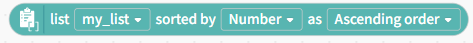 | Sort the elements in the list in ascending or descending order. Sorting options: numeric, alphabetical, or case-insensitive.                                                              |
| 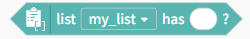 | Check whether a specific element is present in the list.                                                                                                                                  |

## Tuple

| Blocks                                                                                                                                | Note                                                                                          |
| ------------------------------------------------------------------------------------------------------------------------------------- | --------------------------------------------------------------------------------------------- |
| 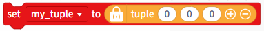 | Assigning a tuple to a variable is equivalent to naming the tuple.                            |
|  | Initialize the tuple.                                                                         |
|  | Get the minimum, maximum, or length of a tuple.                                               |
|  | Determine whether a tuple contains a specific character.                                      |
|  | Use an index to retrieve values from a tuple.                                                 |
|  | Retrieve a specific range of elements from the tuple by specifying the start and end indices. |
|  | Convert the list to a tuple.                                                                  |

## Dictionary

| Blocks                                                                                                                                | Note                                                                              |
| ------------------------------------------------------------------------------------------------------------------------------------- | --------------------------------------------------------------------------------- |
| 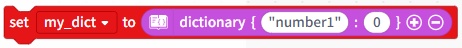 | Assigning a dictionary to a variable is equivalent to naming the dictionary.      |
|  | Initialize the dictionary.                                                        |
|  | Get the value of a dictionary key.                                                |
| 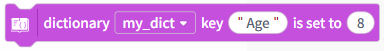 | Modify the value of a dictionary key.                                             |
| 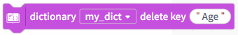 | When you delete a key from a dictionary, the corresponding value is also removed. |
| 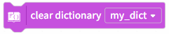 | Clear the dictionary.                                                             |
|  | Determine whether a specific key is present in the dictionary.                    |
|  | Get the length of the dictionary.                                                 |
|  | Returns a list containing all the keys or values in the dictionary.               |

## Set

| Blocks                                                                                                                                | Note                                                                         |
| ------------------------------------------------------------------------------------------------------------------------------------- | ---------------------------------------------------------------------------- |
| 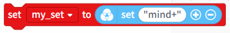 | Assigning a collection to a variable is equivalent to naming the collection. |
|  | Initialize the set.                                                          |
| 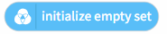 | Initialize an empty set.                                                     |
| 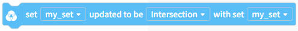 | For elements in two sets, find their intersection, union, or difference.     |
|  | Remove the command content from the collection.                              |
|  | Clear the set.                                                               |
|  | Copy the set.                                                                |
|  | Determine whether the input value is in the set.                             |
| 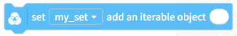 | Add an iterable object to the collection.                                    |
|  | Add a single element to the set.                                             |
|  | Determine whether one set is a subset or a superset of another set.          |
|  | Find the intersection, union, and difference of two sets.                    |
|  | Get the length of the collection.                                            |
|  | Return a random item and remove it from the set.                             |
