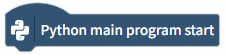
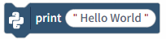
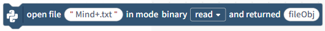

# 3.3.3.8 Python

Python's built-in modules provide a range of fundamental yet powerful functions covering core areas such as program control, user interaction, file operations, and system time handling. These functions enable developers to quickly implement standardized program workflows.

| Blocks                                                                                                                         | Note                                                                                                                                                                                                                                                                                                      |
| ------------------------------------------------------------------------------------------------------------------------------ | --------------------------------------------------------------------------------------------------------------------------------------------------------------------------------------------------------------------------------------------------------------------------------------------------------- |
|  | The main Python program begins.                                                                                                                                                                                                                                                                           |
|  | The `input()` function retrieves keyboard input from the terminal. The prompt is "Please input." It is typically used in conjunction with the `print()` function to display the entered text.                                                                                                         |
|  | Print the output.                                                                                                                                                                                                                                                                                         |
|  | Print "Hello World" without newline, and force immediate output without buffering.                                                                                                                                                                                                                        |
|  | Open the file and return the file object.                                                                                                                                                                                                                                                                 |
|  | You can perform operations on files using binary read, binary write, and binary append.                                                                                                                                                                                                                   |
|  | Close the file object. Once closed, the file can no longer be read. Note that you must close the file after all file operations are complete.                                                                                                                                                             |
|  | Read the contents of the file object.                                                                                                                                                                                                                                                                     |
|  | Write a string to a file.                                                                                                                                                                                                                                                                                 |
|  | Get the system time. You can retrieve the year, month, day, hour, minute, second, day of the week, and day of the year.                                                                                                                                                                                   |
|  | Retrieve the system time; combinations of different system times.                                                                                                                                                                                                                                         |
|  | Retrieve the system timestamp. A timestamp is a digital identifier that uniquely identifies a specific moment in time on Earth. It enables computers to process all time-related operations with precision and efficiency, making it an indispensable fundamental concept in modern software development. |
|  | Retrieve the system time and format it.                                                                                                                                                                                                                                                                   |
