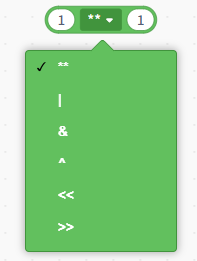
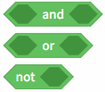
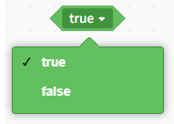

# 3.3.3.2 Operators

In the Python block-based programming environment, operators are used to perform numerical calculations, conditional comparisons, logical evaluations, and data processing. To make them easier to understand and use, Mind+ has broadly categorized these operator blocks into the following five types based on their functions:

## Arithmetic operators

| Blocks                                                                                                                            | Note                                                                                                                                                                        |
| --------------------------------------------------------------------------------------------------------------------------------- | --------------------------------------------------------------------------------------------------------------------------------------------------------------------------- |
|  | Basic arithmetic operators used to perform arithmetic operations such as addition, subtraction, multiplication, and division on numerical values.                           |
|  | Extended data operations, used to perform more advanced mathematical or bitwise operations, including exponentiation, bitwise OR, bitwise AND, bitwise XOR, and bit shifts. |

## Comparison Operators

| Blocks                                                                                                                            | Note                                                             |
| --------------------------------------------------------------------------------------------------------------------------------- | ---------------------------------------------------------------- |
|  | Used to combine multiple conditions and return a logical result. |
|  | Boolean constant: true or false.                                 |

## Data and Type Operations

Used to process data content or analyze its type information.

| Blocks                                                                                                                            | Note                                                           |
| --------------------------------------------------------------------------------------------------------------------------------- | -------------------------------------------------------------- |
|  | Indicates no content or control.                               |
|  | Get the length of a string or list.                            |
|  | Find the element with the largest value in the input sequence. |
|  | Determine whether the input value is true.                     |
|  | The data type of the return value.                             |
|  | Determine whether a variable belongs to a specific data type.  |

## Expression Evaluation

Evaluate the expression immediately and return the result.

| Blocks                                                                                                                            | col2                                                      |
| --------------------------------------------------------------------------------------------------------------------------------- | --------------------------------------------------------- |
|  | Calculates the entered expression and returns the result. |
