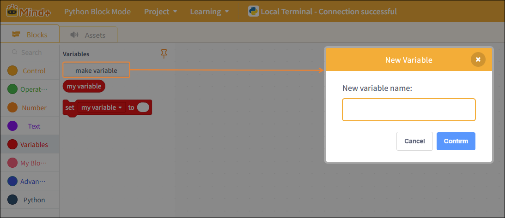
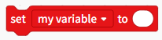

# 3.3.3.5 Variables

Variables are containers for data. In Python, variables do not need to be declared with a specific type, and their type can even be changed after they have been assigned a value.

## Create a new variable

When creating a new variable, the variable name cannot contain the special characters “`~!-@#$%^&*()+<>?:{},./;\'[]\”.

| Blocks                                                                                                                            | Note                                                           |
| --------------------------------------------------------------------------------------------------------------------------------- | -------------------------------------------------------------- |
|  | A variable named "my variable".                                |
|  | You can rename or delete variables, and assign values to them. |
