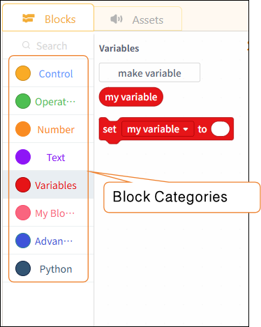

# 3.3.3 Functional Areas - Modules

In the Python block-based programming model, the functionality is divided into two parts: modules and resource files.

#### 1. Modules

In Python's block-based mode, modules are categorized by function into: control, operators, numbers, text, variables, functions, advanced types, and Python.

