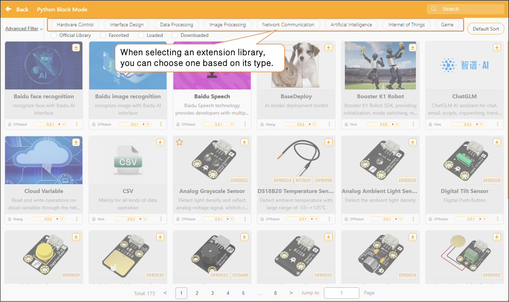
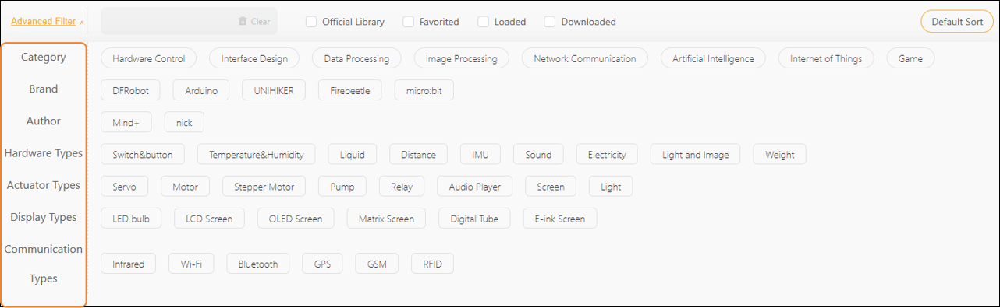
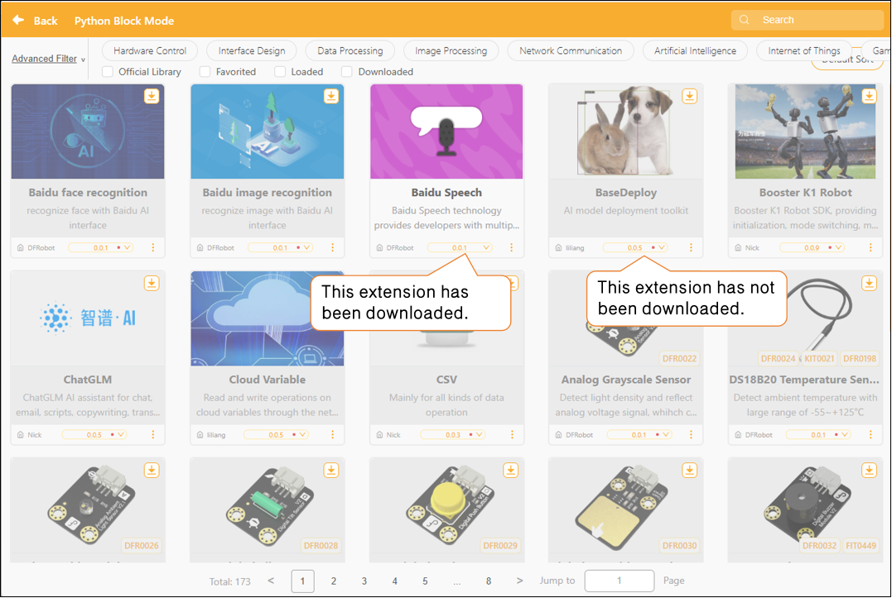
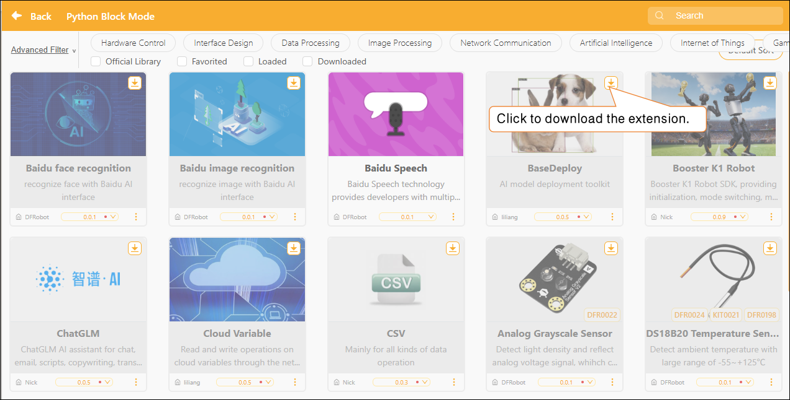

# 3.3.5 Extension Area

n Python Block Mode, users can add various sensor or actuator modules using the "Extension Library" feature. The Extension Library functions similarly to installing corresponding module drivers for the system. Once successfully added, it automatically generates matching Python block commands, helping users quickly implement data reading or motion control, thereby significantly improving programming efficiency and expanding the possibilities for hardware interaction projects.

Want to learn more about the commands in each extension library? Click "[Extension](../../Extension/index.md)" to view detailed descriptions.

In addition, you can use the "Advanced Filter" feature to make precise selections based on sensor type or actuator category, allowing you to find the desired extension library more quickly.

In the Extensions section, each extension module displays version update notifications. If a small red dot appears to the right of the version number, it means the current version has not been downloaded locally.

Select the extension library, click the "Download" button in the upper-right corner, and the extension library will be updated.

#### Frequently Asked Questions

Click here for a solution to the [issue of being unable to download the extension library](../../FAQ/Coding/RealTimeMode/Extension/HowToFixExtensionLibraryDownloadFailure.md).
