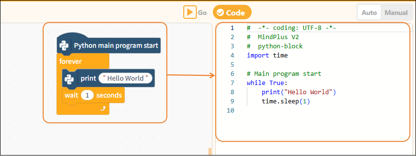
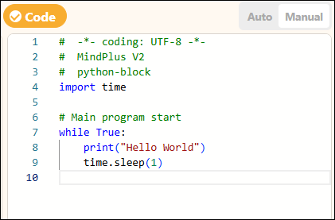

# 3.3.6 Code Display Area

The code display area is used to show the program's code and supports two modes: auto-generation and manual editing.

#### 1. Automatic Generation

When users program using visual blocks, the system automatically converts the block instructions into corresponding Python code and displays it in real time in this area, helping users understand the relationship between visual instructions and code, and facilitating further learning.

#### 2. Manual Editing

In the code preview area, users can also switch to manual editing mode to type Python code directly into the code editor and write complete programs, which is ideal for users with some programming experience.

