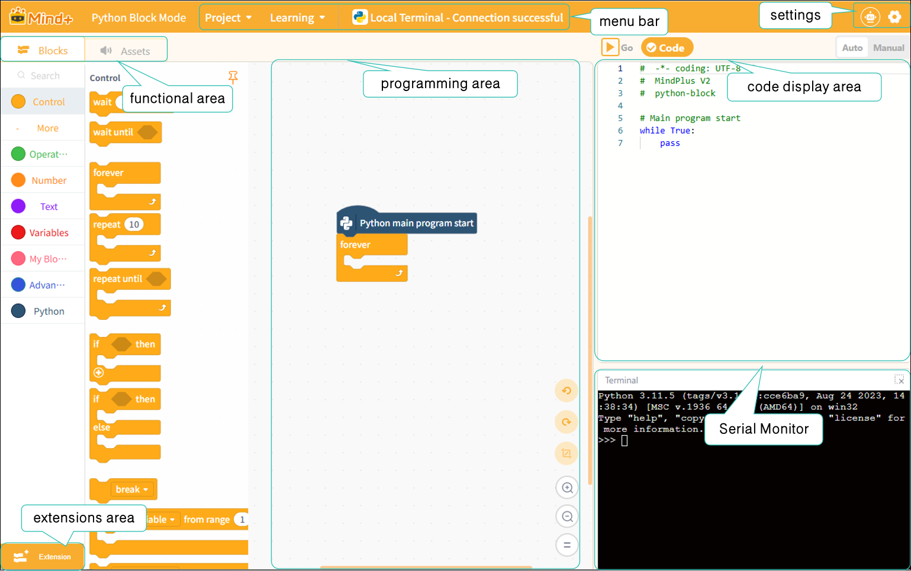

# 3.3 Python Block Mode

The Python Block mode is a programming approach designed for beginners learning Python within the Mind+ programming environment. It presents Python programming logic in the form of blocks, combining the dual advantages of graphical drag-and-drop operations with real-time code generation and display to help beginners easily understand program structure and syntax.Users can quickly build programs by dragging and dropping blocks, and the system will simultaneously generate the corresponding Python code in the code area. Completed programs can be run directly on a computer or on the UNIHIKER M10, enabling immediate application of what you’ve learned.

### Understanding the Interface

The interface can be divided into seven areas: the menu bar, settings, the ribbon, the extensions area, the programming area, the code display area, and the terminal display area.

Next, we’ll take a closer look at these sections. For a detailed overview of each section’s features, click here:

|            [Menu Bar](331MenuBar.md)            |             [Settings ](332Settings.md)             | [Functional Areas-Modules](333FunctionalAreas/index.md) | [Functional area-Asset](334FunctionalAreasResourceFiles.md) |
| :-------------------------------------------: | :----------------------------------------------: | ---------------------------------------------------- | :------------------------------------------------------: |
| [**Extensions area**](334ExtensionArea.md) | [**Programming area**](335ProgrammingArea.md) | [**code display area**](336CodeDisplayArea.md)    |   [**Terminal display area**](337SerialMonitor.md)   |

### Frequently Asked Questions

Click to view [FAQ](../../FAQ/Coding/PythonBlockMode/index.md)
