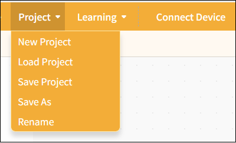
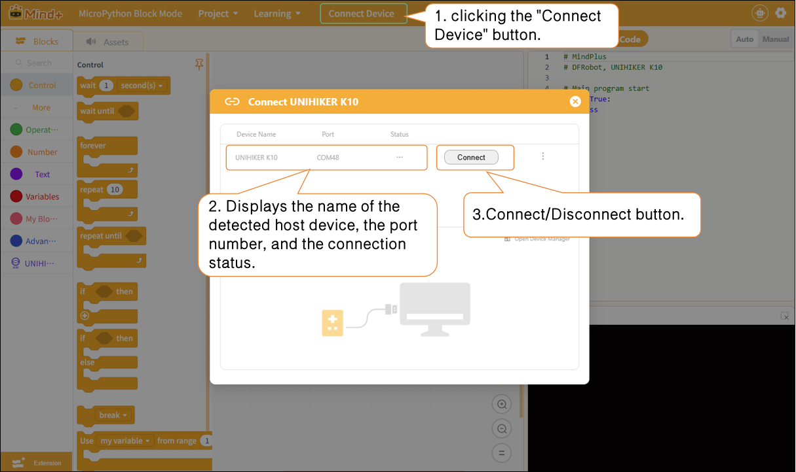
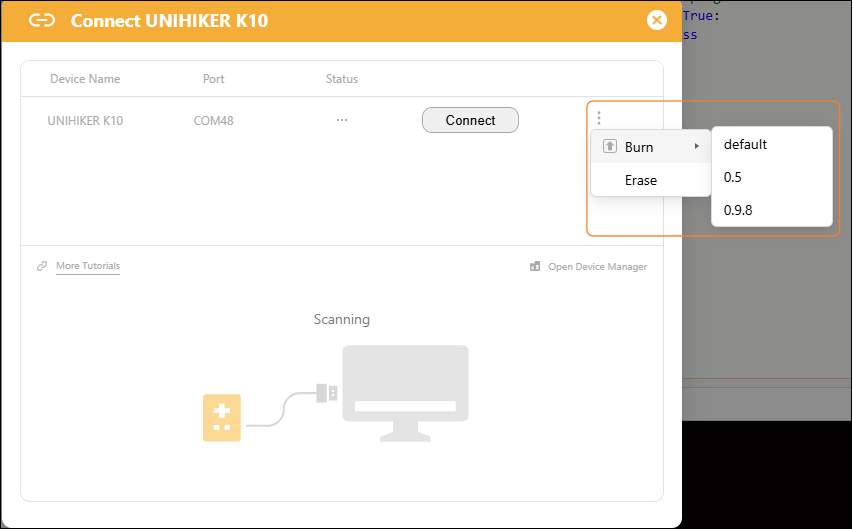

# 3.4.1 Menu Bar

In MicroPython's block mode, the single-column section offers three different ways to interact with projects: Projects, Tutorials, and Connect Devices.

#### 1. Project

Provides project management functions, including creating new projects, opening projects, saving projects, saving as, and renaming, to help users fully manage their programming projects.

| Features      | Note                                                                                                                                                                                    |
| ------------- | --------------------------------------------------------------------------------------------------------------------------------------------------------------------------------------- |
| New Project   | Create a blank project and clear all currently loaded extension instructions so you can start programming from scratch.                                                                 |
| Load project | Load the saved project file to continue editing or running it.                                                                                                                         |
| Save Project  | Save the current project to your computer and update the original file.                                                                                                                 |
| Save As       | Save the current project as a new file. Users can specify the filename and location; the original project will not be overwritten. This is useful for creating backups or new versions. |
| Rename        | Save the current project as a new file. Users can specify the filename and location; the original project will not be overwritten. This is useful for creating backups or new versions. |

## 2. learning

We provide a wide range of learning resources, including official documentation, online forums, video tutorials, and Example programs.

**Note**: The content of the Example program automatically adjusts based on the selected control board to facilitate hands-on learning.

| Features               | Note                                                                                                                                                                                          |
| ---------------------- | --------------------------------------------------------------------------------------------------------------------------------------------------------------------------------------------- |
| Official Documentation | Visit the official documentation page to access a wide range of tutorials                                                                                                                     |
| Online Forums          | Visit the Mind+ official forum to explore a wide range of projects and engage in discussions.                                                                                                 |
| Video Tutorials        | If you're just getting started, you might want to check out some simple examples.                                                                                                             |
| Example Program        | Here is a sample program for the current main control board. Please note that you must first select the main control board in the "Extensions" section before the sample program will appear. |

#### 3. Connecting Devices

In MicroPython Block Mode, after adding a host device, you can connect or disconnect the hardware by clicking the "Connect Device" button. Quick access links to "Tutorials" and "Open Device Manager" are also provided to help troubleshoot hardware connection issues.

## Please note:

After connecting the main controller, you will see an advanced menu to the right of the Connect button. You can use this advanced menu to flash or erase the firmware on the main controller (using the UNIHIKER K10 as an example).

**Flashing**: Flashing the low-level system firmware onto the motherboard; the flashing options include "default," "0.5," "0.9.8," and so on.

| Function Categories | Suboption       | Description of Function                                                                               | Applicable Scenarios                                                                                                                                                                           |
| ------------------- | --------------- | ----------------------------------------------------------------------------------------------------- | ---------------------------------------------------------------------------------------------------------------------------------------------------------------------------------------------- |
| Burn                | default default | Flash the original factory firmware to restore the board to its factory default settings.             | 1. The board system is malfunctioning and cannot connect to Mind+; 2. After flashing third-party firmware (AI/card reader firmware), you must revert to the original programming system; |
|                     | 0.5/0.9.8       | Flash the specified firmware version to upgrade or downgrade the board's underlying system.           | This is required to use the new features in the updated firmware and to ensure compatibility with specific project software.                                                                   |
| Erase               | Erase           | Erase all data from the development board's Flash memory, including user code and installed firmware. | 1. Firmware residue caused the programming to fail; 2. If the board fails to boot or the program keeps throwing errors, first                                                             |
