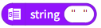
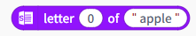
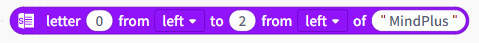

# 3.4.3.4 Text

Text-handling directives provide a comprehensive set of tools for string manipulation, including checking text properties, manipulating string content, converting data types, and formatting text output, to meet the various text-processing needs of everyday programming.

## Property Detection

| Blocks                                                                                                                       | Note                                                                         |
| ---------------------------------------------------------------------------------------------------------------------------- | ---------------------------------------------------------------------------- |
|  | Text input field: Converts the variable in the input field to a string type. |
|  | Determine whether the text consists of numbers or letters.                   |
|  | Check if the text is empty.                                                  |
|  | Determine the length of the text.                                            |

## String Operations

| Blocks                                                                                                                       | Note                                                                                                                                                                                                                      |
| ---------------------------------------------------------------------------------------------------------------------------- | ------------------------------------------------------------------------------------------------------------------------------------------------------------------------------------------------------------------------- |
|  | Concatenate strings or numbers and return a string. For example, concatenating "world" and "hello" returns the string "worldhello".多模型翻译对比                                                                         |
|  | Conditional check: Determine whether a string contains a specific character. If it does, the result is true (1); if not, the result is false (0). For example, since "apple" contains the letter "a," the result is true. |
|  | Retrieve a single character from a string, starting from 1.                                                                                                                                                               |
|  | Retrieve a contiguous segment of characters from the string.                                                                                                                                                              |
|  | Find a character, or find the first or last occurrence of a character or number in a string.                                                                                                                              |

## Type conversion

| Blocks                                                                                                                       | Note                                                |
| ---------------------------------------------------------------------------------------------------------------------------- | --------------------------------------------------- |
|  | Convert a string to an integer or a decimal number. |
|  | Convert the number to an ASCII character.           |
|  | Convert characters to ASCII values.                 |
|  | Convert the number to a string.                     |

## Formatted output

| Blocks                                                                                                                       | Note                                                                                                                                                                                                                                                                                                                                                                                                                                                                                                                                                                                                                                                                                                                                                                                                                       |
| ---------------------------------------------------------------------------------------------------------------------------- | -------------------------------------------------------------------------------------------------------------------------------------------------------------------------------------------------------------------------------------------------------------------------------------------------------------------------------------------------------------------------------------------------------------------------------------------------------------------------------------------------------------------------------------------------------------------------------------------------------------------------------------------------------------------------------------------------------------------------------------------------------------------------------------------------------------------------- |
|  | Formatted strings—% placeholder notation. For example: If there is a variable num=3.14159, using “Value: %.2f ”%num will produce the result “Value: 3.14”. %.2f means: Format the variable as a floating-point number and retain two decimal places.                                                                                                                                                                                                                                                                                                                                                                                                                                                                                                                                                                  |
|  | Formatted strings—format placeholder notation. For example, the format “Value: {:.3}” (5) will produce the result “Value: 5”.Detailed explanation: In “Value: {:.3}” format(5), since an integer is passed in, it is treated as a string. The precision .3 indicates that the first 3 characters should be truncated, but “5” consists of only 1 character, so the output is “Value: 5”.                                                                                                                                                                                                                                                                                                                                                                                                                        |
|  | Text escape characters are a type of special character. \n represents a newline character, which moves the cursor to the beginning of the next line. \r represents a carriage return character, which positions the cursor at the beginning of the current line without moving to the next line. \n\r first moves the cursor to the next line and then positions it at the beginning of the current line. \r\n moves the cursor to the beginning of the current line and then creates a new line at that position. \b represents the backspace character, similar to the Backspace key on a keyboard. \t represents a tab character, moving the cursor to the next tab position, similar to using the Tab key in a document. \ denotes the backslash character; to use a backslash ( ‘\’), you must use two backslashes. |
