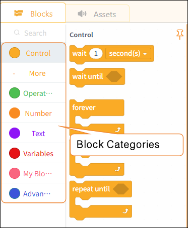

# 3.4.3 Functional Areas

In MicroPython's block-based mode, the workspace is divided into two sections: modules and resource files.

#### 1. Modules

In MicroPython's block-based mode, module blocks are categorized by function into: control, operators, numbers, text, variables, functions, and advanced types.

