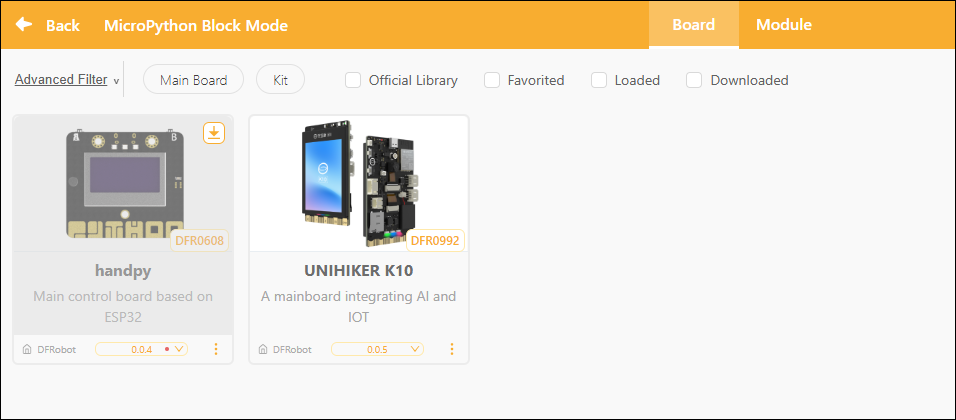
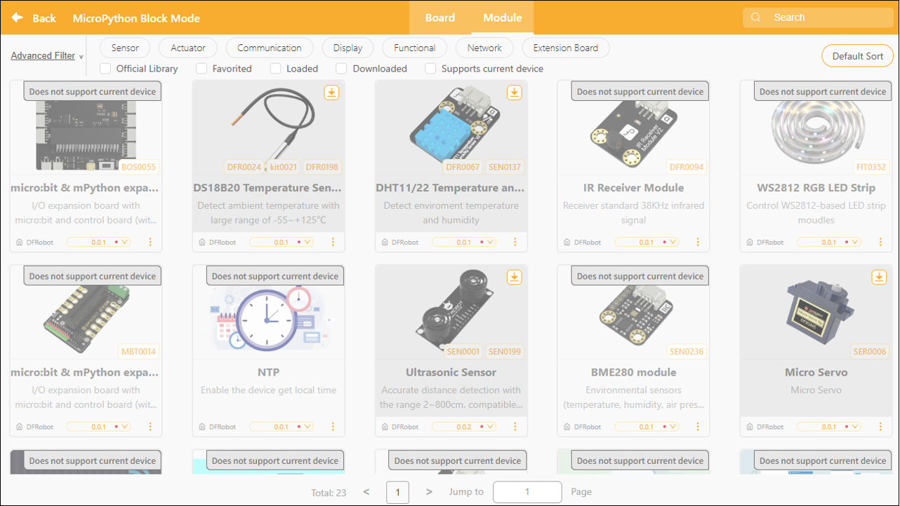
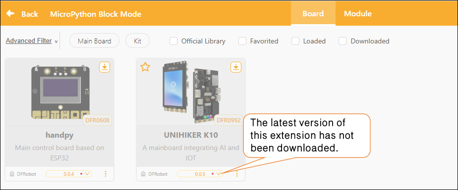
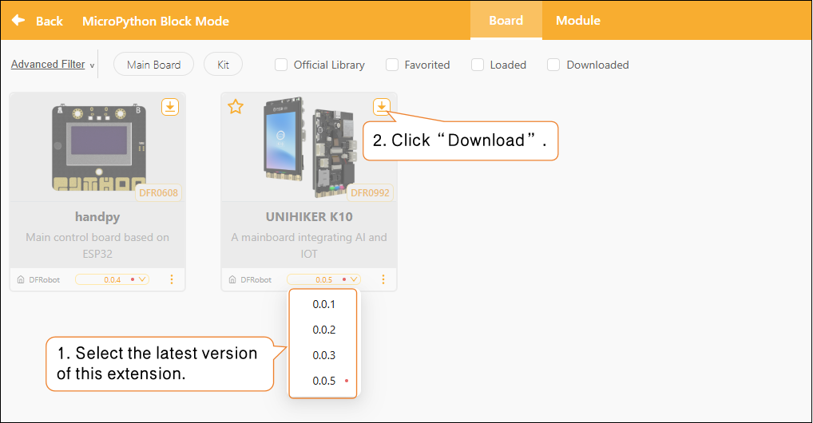
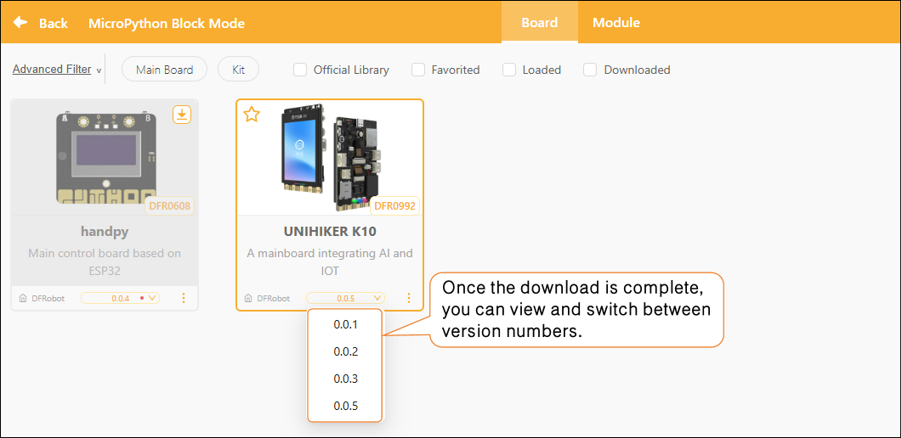

# 3.4.5 Extension Area

In Micropython's block mode, the extension area supports two types of extensions:

* Main Controller Expansion: Used to select or replace the hardware main controller board currently used for programming, such as the Control Board or the Xingkong K10.
* Module Expansion: Once the main controller has been selected, you can further add sensors, actuators, or functional modules compatible with that controller to enhance the program's capabilities.

By configuring the expansion zone, users can flexibly select hardware controllers based on project requirements and load the corresponding modules to enable additional hardware interaction features.   

Want to learn more about the commands in each extension library? Click "[Extension](../../FAQ/Extension/MicroPythonBlockMode/index.md)" to view detailed descriptions.

#### 1. Controller Expansion

The controller expansion module is a core component of the system for identifying and controlling hardware; once loaded, it can drive the corresponding controller board.

#### 2. Module Extensions

Module expansion is a feature that automatically displays compatible modules after a main control board has been selected. The system lists available modules based on the hardware supported by the main control board, and users can manually select and add them according to project requirements. These modules can be used to enhance project functionality and enable more sophisticated interaction and control.

#### 3. Extension Library Updates

In the Extensions section, each extension module displays version update notifications. If a small red dot appears to the right of the version number, it means the current version has not been downloaded locally.

##### How to Update

Select the latest version of the corresponding extension, then click the "Download" button to update it.

Once the update is complete, the red dot next to the version number will automatically disappear, and you can switch to the desired version as needed.

#### 4. Frequently Asked Questions

Click here for a solution to the [issue of being unable to download the extension library](../../FAQ/4Extension.md).
