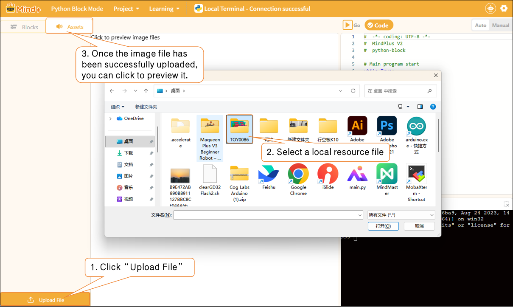

# 3.4.4 Functional Areas - Asset

In the Python Block-Based Programming environment, a "resource file" refers to an area used to store various auxiliary files that need to be called by the program within a project. It functions like a "project resource library," making it easy for you to reference these resources while writing Python programs.

Resource files may contain the following:

| Resource Type             | Example                         | Uses                                                                |
| ------------------------- | ------------------------------- | ------------------------------------------------------------------- |
| Image files (.png / .jpg) | Character images, icons         | Displaying images in a program or using them as interface elements. |
| Audio files (.mp3 / .wav) | Background music, sound effects | Used to play sound effects or voice prompts.                        |
| Text file (.txt)          | Data logs, dialogue text        | Read as data or content using a program                             |
| JSON / CSV files          | Configuration data, table data  | For data analysis or parameter retrieval                            |
| Python script (.py)       | Custom library code             | Can be imported and reused by the main program                      |

Click the "Upload File" button to add the required resource files from your local device. Once uploaded, image resources can be previewed directly, making it easy to quickly verify that the content is correct.

