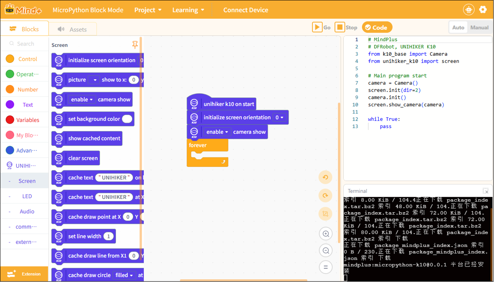

# 3.4.6 Programming Area

The Programming Area is the core section for building programs and designing logic. In MicroPython Block Mode, users can drag and drop various MicroPython blocks here to construct complete program logic. All instructions in the Module Area can be dragged into the Programming Area to build programs.

