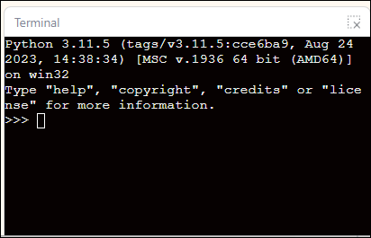

# 3.4.8 Terminal Display Area

The terminal display area is used to show the output and debugging information generated while the program is running. When you run a Micropython block program, everything printed using the `print` statement will be displayed in real time in this area, helping you observe the program’s execution and verify that the logic is correct. In the terminal display area, you can:

* View the program's results and output;
* Observe changes in variable values or sensor data feedback;
* Debug the program logic and identify errors;
* In some cases, data is entered to interact with the program (such as when keyboard input is required).

The terminal display area serves as a bridge between the "program logic" and the "execution results," playing a crucial role in understanding how Python blocks are executed and in debugging projects.

