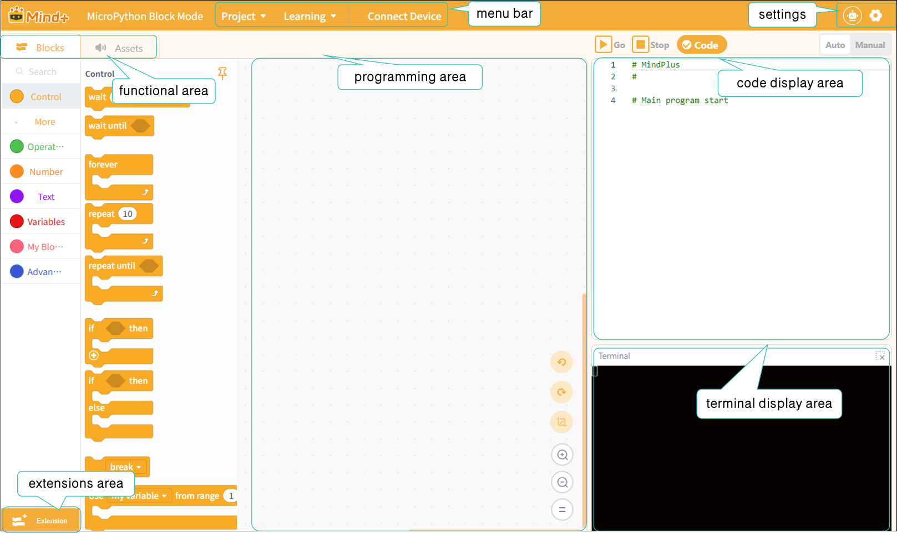

# 3.4 Micropython Block Mode

MicroPython Block Mode is a graphical programming method provided by Mind+, which combines the syntactic features of the Python programming language while retaining the intuitiveness and ease of use of block-based programming.In this mode, users can design programs by dragging and dropping blocks, which automatically generate equivalent Python code to enable hardware control and logic programming.

MicroPython is a lightweight version of Python designed specifically for embedded devices (such as the Control Board and Xingkong K10), enabling it to run on hardware with limited resources. It retains Python’s core syntax while streamlining or rewriting certain libraries and features to suit the hardware environment.

## Features

* **Combining Visualization with Code**: Each block in the block-based mode corresponds to Python code, which users can view and understand at any time.
* **Wide hardware support**: Supports Mind+ control boards (such as the K10 and Control Board) and their expansion modules, including sensors, servos, motors, displays, and more.
* **Modular blocks**: The blocks are grouped by function and cover common programming features such as control, operators, numbers, text, variables, functions, and advanced types.
* **Low learning curve**: Even users with no programming background can create programs by dragging and dropping blocks, while gradually gaining an understanding of Python syntax and logical structures.

## Understanding the Interface

Once you enter MicroPython Block Mode, you will see the following interface.

The interface can be divided into seven areas: the menu bar, settings, the ribbon, the extensions area, the programming area, the code display area, and the terminal display area.

Next, we’ll take a closer look at these sections. For a detailed overview of each section’s features, click here:

|            [Menu Bar](341MenuBar.md)            |             [Settings ](342Settings.md)             | [Functional Areas-Modules](343FunctionalAreas/index.md) |     [Functional area-Asset](344FunctionalAreasAsset.md)     |
| :-------------------------------------------: | :----------------------------------------------: | ---------------------------------------------------- | :-------------------------------------------------------: |
| [**Extensions area**](344ExtensionArea.md) | [**Programming area**](345ProgrammingArea.md) | [**code display area**](346CodeDisplayArea.md)    | [**Terminal display area**](347TerminalDisplayArea.md) |

### Frequently Asked Questions

Click to view [FAQ](../../FAQ/Coding/MicropythonBlockMode/index.md)
