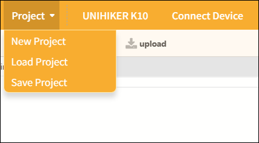
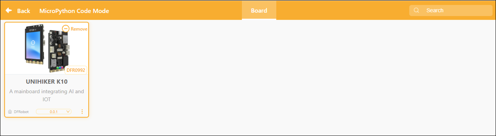
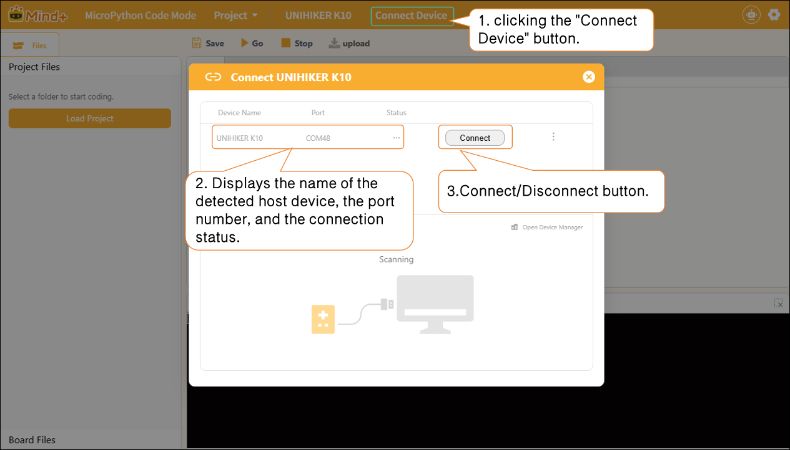

# 3.5.1 Menu Bar

The menu bar provides project operations for upload mode, including Project, Select Motherboard, and Connect Device.

## 1. Project

Provides project management functions, including creating new projects, opening projects, and saving projects, to help users fully manage their programming projects.

| Features     | Note                                                                                                                    |
| ------------ | ----------------------------------------------------------------------------------------------------------------------- |
| New Project  | Create a blank project and clear all currently loaded extension instructions so you can start programming from scratch. |
| Load project | Load the saved project file to continue editing or running it.                                                         |
| Save Project | Save the current project to your computer and update the existing file.                                                 |

## 2. Selecting a Board

Click the "Board" button to be automatically redirected to the "Controller Expansion" page, where you can select the desired controller board.

## 3. Connecting Devices

In MicroPython Code Mode, after adding a host device, you can connect or disconnect the hardware by clicking the "Connect Device" button. Quick access links to "Tutorials" and "Open Device Manager" are also provided to help troubleshoot hardware connection issues.

## Please note:

After connecting the main controller, you will see an advanced menu to the right of the Connect button. You can use this advanced menu to flash or erase the firmware on the main controller (using the Xingkong K10 as an example).

**Flashing**: Flashing the low-level system firmware onto the motherboard; the flashing options include "default," "0.5," "0.9.8," and so on.

| Function Categories | Suboption       | Description of Function                                                                     | Applicable Scenarios                                                                                                                                                                           |
| ------------------- | --------------- | ------------------------------------------------------------------------------------------- | ---------------------------------------------------------------------------------------------------------------------------------------------------------------------------------------------- |
| Burn                | default default | Flash the original factory firmware to restore the board to its factory default settings.   | 1. The board system is malfunctioning and cannot connect to Mind+; 2. After flashing third-party firmware (AI/card reader firmware), you must revert to the original programming system; |
|                     | 0.5/0.9.8       | Flash the specified firmware version to upgrade or downgrade the board's underlying system. | This is required to use the new features in the updated firmware and to ensure compatibility with specific project software.                                                                   |
| Erase               | Erase           | Erase all data from the development board's Flash memory, including                         |                                                                                                                                                                                                |
