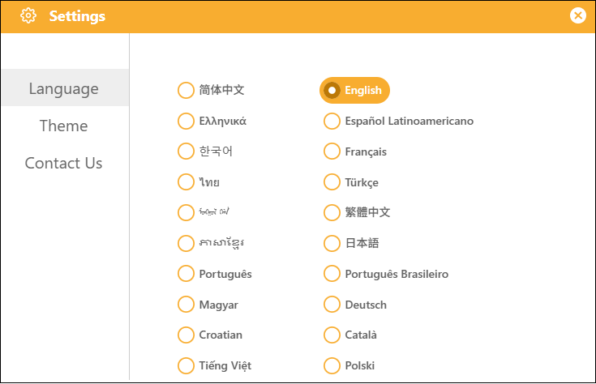
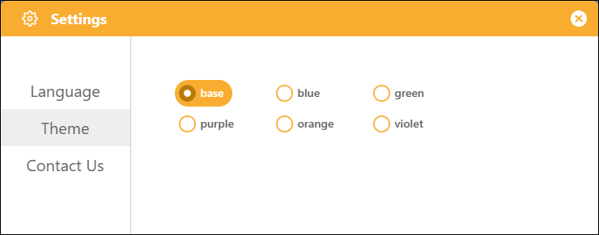
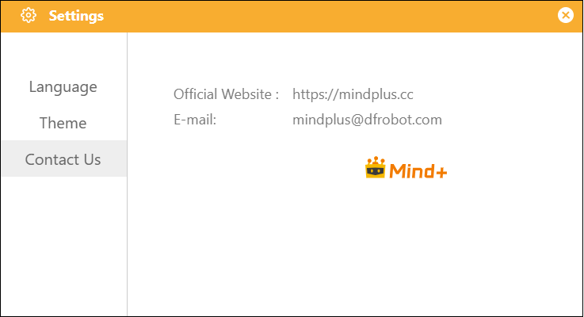

# 3.5.2 Settings

The Settings interface provides access to the software's global settings. Click the "Settings" button to open it.

#### 1. Language

Supports 20 different languages, selectable by the user, to meet a wide range of user needs.

#### 2. Theme

It supports six different themes, allowing you to change the overall color scheme of the interface to suit different user preferences.

#### 3. Contact Us

Find our official contact information under "Contact Us" in the settings, join our study group, and connect with other users to learn together.

