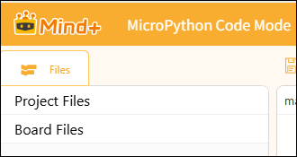
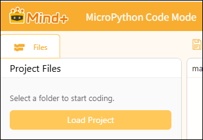
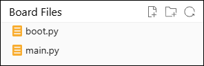

# 3.5.3 File Area

In MicroPython code mode, files are divided into **project files** and **board files**, each with a distinct role, working together to support the development process:

## 1. Project Files

Project files are stored locally on your computer and constitute a collection of project files used during the development process. Here, you can create, open, and save code files, as well as modify, back up, or manage the entire project at any time—just like your "code notebook." These files are stored only on your computer and do not automatically affect the operation of your device.

**Note**:

The term "project file" has different definitions in MicroPython's block-based mode and code-based mode, so we need to distinguish between them.

| Mode                      | Project Definition                                | Save format                                                                                                                                                                                           | Storage Logic                                                                                  | Important Notes                                                                                                                                                                                                                                                                                                 |
| ------------------------- | ------------------------------------------------- | ----------------------------------------------------------------------------------------------------------------------------------------------------------------------------------------------------- | ---------------------------------------------------------------------------------------------- | --------------------------------------------------------------------------------------------------------------------------------------------------------------------------------------------------------------------------------------------------------------------------------------------------------------- |
| MicroPython Block Mode    | 1 project = 1 .mpcode archive                     | Save as a standalone mpcode file, bundling all block code along with images, audio, and other project resources.                                                                                      | The software is packaged internally, and each project is a separate compressed file.           | The software is packaged internally, and each project is a separate compressed file.                                                                                                                                                                                                                            |
| MicroPython Code Patterns | Project = A folder selected on the local computer | MPcode package files are no longer generated; all files are stored in their original formats within the project folder, following the same logic as VS Code (where the folder serves as the project). | Using local directory management, all code and assets are stored in the selected local folder. | Do not select extremely large directories such as the desktop directly. Instead, create a separate folder specifically for the project, place all project resources—including mian.py, images, and audio files—into that folder, and then select it as the project directory. Do not select the entire drive. |

## 2. Board files

Board files are stored directly in the file system of the connected control board (such as the UNIHIKER K10, Zhan Kong Board, or ESP32). These are program files that are read and executed immediately after the device powers on, such as `boot.py`the (startup script) and `main.py`(main program).You must upload the project files to the device for them to appear here; the device can then run these programs independently even when disconnected from the computer.

Key Differences Between Project Files and Mainboard Files.

| Comparison items | Project Documents                                                              | Motherboard Documentation                                                                                         |
| ---------------- | ------------------------------------------------------------------------------ | ----------------------------------------------------------------------------------------------------------------- |
| Storage location | Saved locally on your computer as your project files.                          | Save directly to the file system on the main control board (Xingkong K10 / Control Board / ESP32.                 |
| Function         | Edit, save, and manage your local code projects—it’s like your “notebook.” | Directly managing the runtime files on the device is equivalent to the device’s “program memory.”              |
| Sample Documents | `.py`The code files and project configuration files you created.             | `.py`The code files and project configuration files you created.                                                |
| How to Use       | New, Open, Save, Save As—just like with regular computer files.               | You must connect to a device to use this feature; you can create, edit, and refresh files directly on the device. |
| Affiliation      | It can stand alone; once uploaded, it will be synced to the main board files.  | Files are stored on the device and remain there even after the power is turned off.                               |
